

<picture>
  <source media="(prefers-color-scheme: dark)" srcset="assets/banner-dark.svg">
  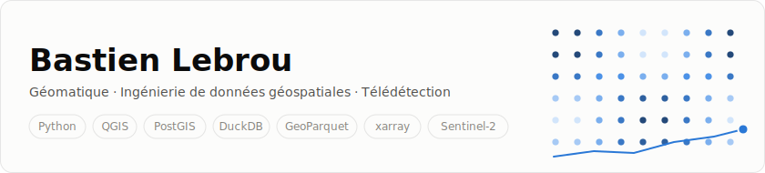
</picture>

## 🧭 À propos

Développeur **géomatique & data engineering** : j'analyse des territoires à partir de données
géospatiales — imagerie satellite, open data, cadastre — avec un objectif constant : des
**pipelines reproductibles, testés et cartographiables** plutôt que des scripts jetables.

- 🐍 Écosystème Python SIG : GeoPandas, Shapely, PostGIS, **DuckDB spatial**, GeoParquet, QGIS
- 🛰️ Télédétection & datacubes : STAC, Sentinel-2, xarray/dask, odc-stac, rasterio
- 📈 Statistiques de tendance : Mann-Kendall, pente de Sen, anomalies & VCI
- 🧪 Qualité : pytest, ruff, mypy, pre-commit, intégration continue GitHub Actions

## 🗂️ Projets

### 🌿 VegeVigie — sentinelle de la végétation

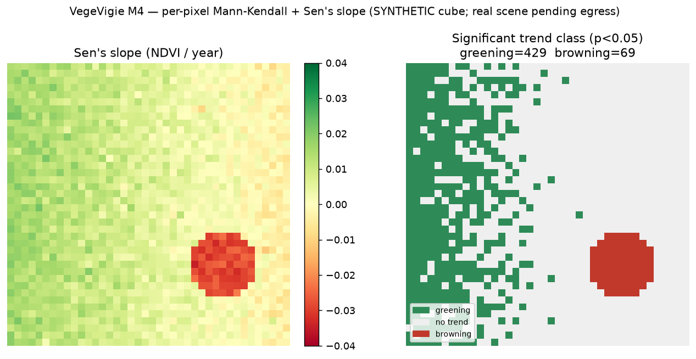

Pipeline de géo-ingénierie de données **reproductible** qui surveille la santé de la végétation
en Ardèche à partir d'une décennie d'images **Sentinel-2** : séries temporelles NDVI →
composites mensuels → **tendances statistiquement significatives** (Mann-Kendall + Sen) →
**stress hydrique** (anomalies, VCI) → agrégation et **classement par commune** (DuckDB +
GeoParquet) → tableau de bord.

- CLI `typer` en étapes idempotentes et cachées : `aoi → search → cube → ndvi → trend → drought → zonal`
- Noyau statistique **vectorisé** (numpy/dask), validé contre `pymannkendall`
- **60+ tests** hors-ligne, lint et CI sur chaque push
- 🧩 **ScruTech** : plugin QGIS Processing qui pilote le même moteur en un clic depuis QGIS

➡️ [Code, démos et méthodologie](vegevigie/) · [Plugin QGIS ScruTech](vegevigie/qgis_plugin/)

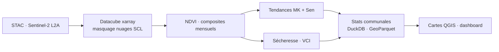

### 🏢 Mini data centers résidentiels — sélection de sites SIG

Méthodologie et outillage de **scoring de parcelles cadastrales** pour l'implantation de mini
data centers résidentiels : filtrage spatial multi-critères (foncier, raccordement **fibre
ARCEP**, énergie, nuisances sonores, contraintes réglementaires), pensé coût d'abord et
cloud-native.

- Scripts de téléchargement **open data** (ARCEP fibre, espaces boisés classés) et d'adaptation de données réelles
- Analyse réelle multi-axes sur la commune d'**Alba-la-Romaine** avec export **GeoPackage + styles QML** prêts pour QGIS
- Architecture cible : dbt-duckdb spatial → GeoParquet partitionné → index **H3** → PMTiles

➡️ [Méthodologie, prompts SIG et outil](_data_center_sig/)

## 🔬 Analyses en images

Figures produites par le vrai code du pipeline VegeVigie (démos sur données synthétiques,
reproductibles via `vegevigie run --small`) :

<table>
  <tr>
    <td align="center" width="50%">
       
      <b>Tendances par pixel</b> — verdissement/brunissement, Mann-Kendall + pente de Sen
    </td>
    <td align="center" width="50%">
      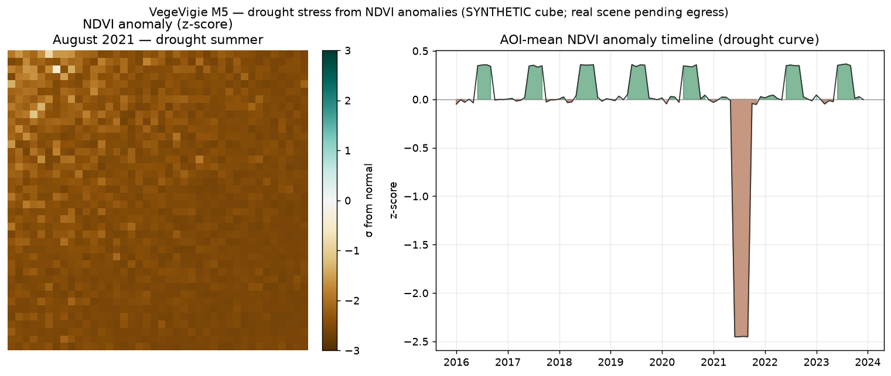 
      <b>Stress hydrique</b> — anomalies NDVI (z-score) et indice VCI
    </td>
  </tr>
  <tr>
    <td align="center" width="50%">
      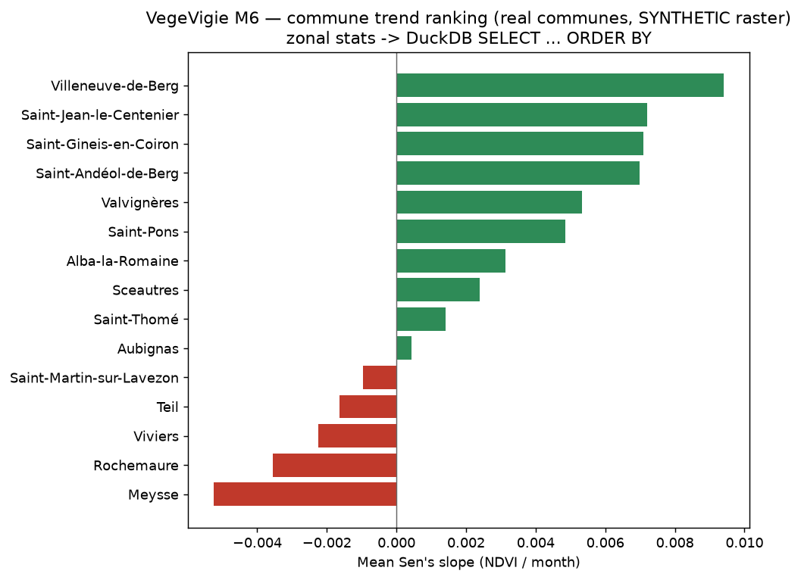 
      <b>Classement communal</b> — agrégation zonale et requêtes DuckDB
    </td>
    <td align="center" width="50%">
      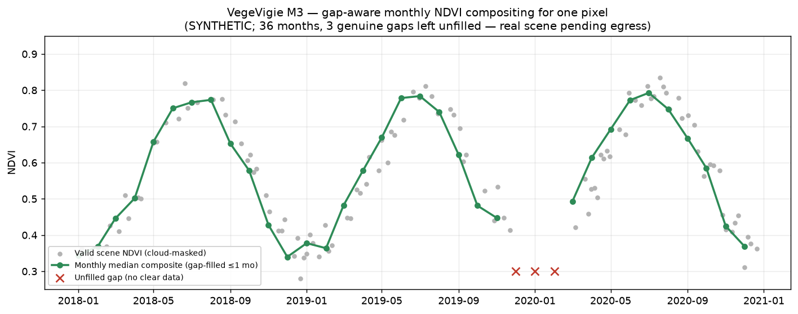 
      <b>Séries temporelles</b> — composites NDVI mensuels, robustes aux nuages
    </td>
  </tr>
</table>

## 📊 Statistiques du dépôt

Chiffres et graphiques **générés automatiquement toutes les 48 h** depuis l'historique Git
réel (script [`scripts/generate_stats.py`](scripts/generate_stats.py), sans dépendance externe).

<!-- AUTO-STATS:START -->
| 📦 Commits | 📅 Jours actifs | 🗂️ Projets |
|:---:|:---:|:---:|
| **22** | **7** | **2** |

| 🐍 Lignes de Python | ✅ Tests automatisés | 🥇 Langage principal |
|:---:|:---:|:---:|
| **6 268** | **62** | **Python (65,2 %)** |

*Dernière mise à jour automatique : 13 juillet 2026 à 11:57 (heure de Paris) — commit `955bbc8`.*
<!-- AUTO-STATS:END -->

<picture>
  <source media="(prefers-color-scheme: dark)" srcset="assets/activity-dark.svg">
  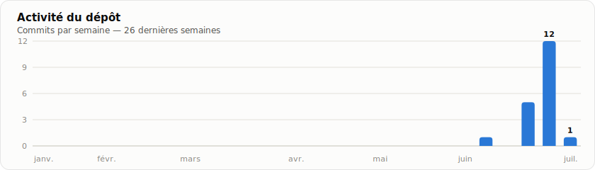
</picture>

<table>
  <tr>
    <td width="50%">
      <picture>
        <source media="(prefers-color-scheme: dark)" srcset="assets/languages-dark.svg">
        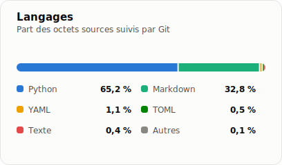
      </picture>
    </td>
    <td width="50%">
      <picture>
        <source media="(prefers-color-scheme: dark)" srcset="assets/weekdays-dark.svg">
        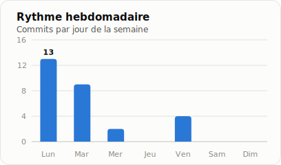
      </picture>
    </td>
  </tr>
</table>

## 🛠️ La stack en un schéma

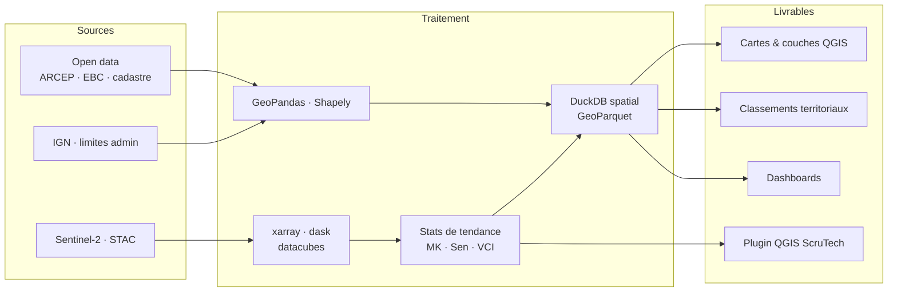

## ⚙️ Automatisation du portfolio

Cette page s'entretient toute seule : un workflow GitHub Actions
([`portfolio.yml`](.github/workflows/portfolio.yml)) tourne **tous les deux jours**, régénère
statistiques et graphiques SVG (thèmes clair/sombre) depuis l'historique Git, puis committe le
résultat — un commit d'activité est créé même sans changement.

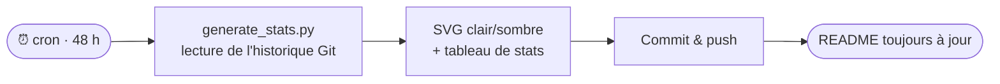

## 📫 Contact

- GitHub : [@BastienLebrou](https://github.com/BastienLebrou)
- E-mail : [bastienlebrou1@gmail.com](mailto:bastienlebrou1@gmail.com)

Les statistiques et visuels de cette page sont calculés depuis l'historique Git réel du
dépôt — rien n'est saisi à la main.
