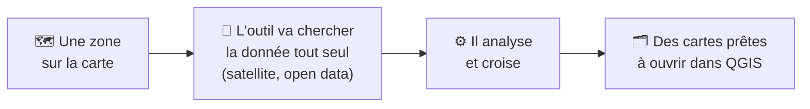

<picture>
  <source media="(prefers-color-scheme: dark)" srcset="assets/banner-dark.svg">
  
</picture>

 

### Bastien Lebrou

**Je fais parler les cartes.** J'analyse des territoires à partir d'images satellites et de
données publiques pour répondre à des questions concrètes.

`Portfolio géomatique & données` · `projet personnel` · `open source`

## En deux mots

Imaginez une **boîte à outils** qui regarde un bout de territoire depuis l'espace et le croise
avec les données publiques disponibles. On lui désigne une zone sur la carte, elle va chercher
la donnée toute seule, l'analyse, et rend des **cartes prêtes à ouvrir**.

Chaque outil répond à **une question** que se posent les collectivités, les gestionnaires
d'espaces naturels ou les bureaux d'études. Le tout forme une seule plateforme, **ScruTech**.

## Un aperçu, en images

La carte ci-dessous est une vraie sortie de l'outil sur une zone en Ardèche. Chaque hexagone
est une petite zone du territoire, coloriée selon son importance pour la nature : **en rouge**,
les zones prioritaires ; **en orange**, celles à regarder de plus près ; **en gris**, le reste.

  

<table>
  <tr>
    <td align="center" width="50%">
       
      <b>La forêt verdit-elle ou dépérit-elle ?</b> Vert = ça pousse, rouge = ça décline
    </td>
    <td align="center" width="50%">
       
      <b>Où la végétation a-t-elle soif ?</b> Les zones en stress hydrique ressortent
    </td>
  </tr>
  <tr>
    <td align="center" width="50%">
       
      <b>Quelles communes surveiller ?</b> Un classement, commune par commune
    </td>
    <td align="center" width="50%">
       
      <b>Comment ça évolue dans le temps ?</b> La santé de la végétation, mois après mois
    </td>
  </tr>
</table>

## Les outils, une question chacun

| | Outil | La question à laquelle il répond |
|:---:|---|---|
| 🌿 | **VegeVigie** | La forêt se porte-t-elle bien ? En empilant dix ans de photos satellite, l'outil repère où la végétation pousse, où elle décline, et où elle souffre de la sécheresse. |
| 🕸️ | **Biotrame** | Où concentrer les efforts pour la nature ? En croisant tous les indicateurs sur une grille, l'outil met en avant les zones prioritaires (compensation écologique). |
| 🛰️ | **AlphaEarth** | Qu'est-ce qui a changé sur le terrain d'une année à l'autre ? On s'appuie sur des « empreintes » satellite de Google pour classer le paysage et repérer les évolutions. |
| 🔥 | **PAF** | Où le feu menace-t-il les maisons ? L'outil trace la ligne exacte où la forêt touche les habitations, là où le débroussaillement est obligatoire. |
| 🌾 | **Écobuage** | Quelles parcelles peut-on brûler sans danger ? Chaque zone reçoit une note selon la végétation, la pente, l'accès et les protections en place. |
| 🏚️ | **SDBPi** | Quels locaux commerciaux semblent vides ? On croise les bâtiments et les entreprises actives : pas d'entreprise enregistrée à l'adresse, bâtiment à vérifier. |
| 🏢 | **Mini data centers** | Où installer un petit data center chez des particuliers ? On écarte les terrains impossibles, puis on note ceux qui restent. |
| 🌍 | **Climate Risk** | Mes fournisseurs sont-ils sur des zones déboisées ou menacées par le climat ? Un prototype de conformité (réglementation européenne EUDR). |

Chaque outil a sa propre page détaillée : [VegeVigie](scrutech/vegevigie/) ·
[Biotrame](scrutech/biotrame/) · [AlphaEarth](scrutech/alphaearth/) · [PAF](scrutech/paff/) ·
[Écobuage](scrutech/ecobuage/) · [SDBPi](scrutech/sdbpi/) ·
[Mini data centers](scrutech/mini_dc/) · [Climate Risk](scrutech/climate_risk_analyzer/).

## Comment ça marche

Toujours le même principe, quel que soit l'outil : on part d'une zone, on finit avec des cartes.

```mermaid
flowchart LR
    A["🗺️ Une zone<br/>sur la carte"] --> B["📡 L'outil va chercher<br/>la donnée tout seul<br/>(satellite, open data)"]
    B --> C["⚙️ Il analyse<br/>et croise"]
    C --> D["🗂️ Des cartes prêtes<br/>à ouvrir dans QGIS"]
```

Et tout se lance aussi **en un clic** depuis QGIS, le logiciel de cartographie que connaissent
les géomaticiens, grâce à une extension dédiée.

<b>🔧 Pour les curieux : sous le capot</b>

 

Rien n'est bricolé à la main : chaque analyse est un **programme reproductible**, testé, qu'on
peut relancer à l'identique. Les grands blocs techniques :

| Domaine | Outils employés |
|---|---|
| Images satellites & séries temporelles | Sentinel-2, STAC, xarray / dask, rasterio |
| Traitement de données géo | GeoPandas, Shapely, PostGIS, DuckDB spatial, GeoParquet |
| Statistiques de tendance | Mann-Kendall, pente de Sen, Pettitt, VCI |
| Analyse multicritère & maillage | scoring pondéré, grille hexagonale H3, connectivité |
| Restitution | extension QGIS, cartes, tableaux de bord, tuiles web |
| Qualité du code | plus de 150 tests automatisés, intégration continue, typage |

Le tout repose sur un **socle commun** (`core`) : une zone en entrée, et tout le reste en
découle (lecture / écriture des données, base spatiale, rangement des résultats). Le détail
complet est dans [`CARTOGRAPHIE.md`](scrutech/CARTOGRAPHIE.md) et la
[politique de sécurité](SECURITY.md).

## Le projet en chiffres

Ces chiffres se mettent à jour **tout seuls, tous les deux jours**, à partir de l'historique réel
du projet.

<!-- AUTO-STATS:START -->
| 📦 Commits | 📅 Jours actifs | 🗂️ Projets |
|:---:|:---:|:---:|
| **87** | **39** | **1** |

| 🐍 Lignes de Python | ✅ Tests automatisés | 🥇 Langage principal |
|:---:|:---:|:---:|
| **16 200** | **152** | **Python (71,2 %)** |

*Dernière mise à jour automatique : 13 septembre 2026 à 14:16 (heure de Paris) — commit `b1c49e7`.*
<!-- AUTO-STATS:END -->

<picture>
  <source media="(prefers-color-scheme: dark)" srcset="assets/activity-dark.svg">
  
</picture>

Voir la répartition des langages et des jours de travail

<table>
  <tr>
    <td width="50%">
      <picture>
        <source media="(prefers-color-scheme: dark)" srcset="assets/languages-dark.svg">
        
      </picture>
    </td>
    <td width="50%">
      <picture>
        <source media="(prefers-color-scheme: dark)" srcset="assets/weekdays-dark.svg">
        
      </picture>
    </td>
  </tr>
</table>

## Me contacter

Je cherche un poste de **géomaticien** (Métropole de Lyon ou en télétravail). Discutons-en.

- GitHub : [@BastienLebrou](https://github.com/BastienLebrou)
- E-mail : [bastienlebrou1@gmail.com](mailto:bastienlebrou1@gmail.com)

Les chiffres et graphiques de cette page sont calculés depuis l'historique réel du projet.
Rien n'est saisi à la main.
