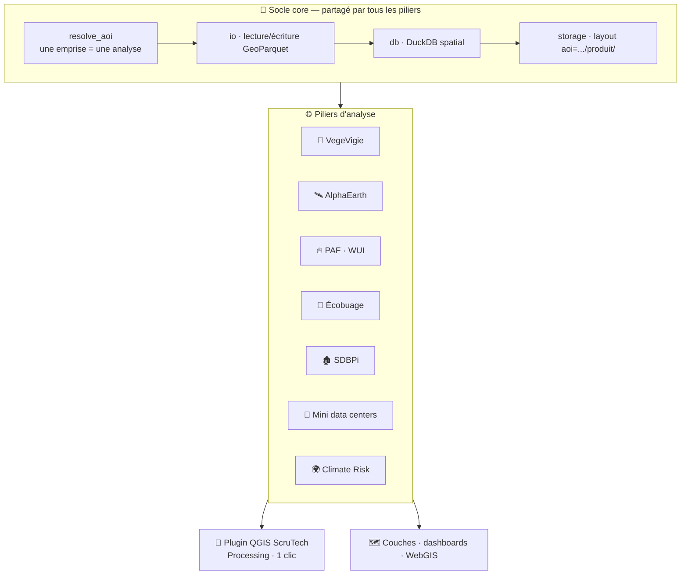
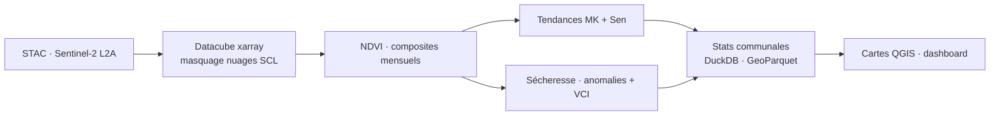
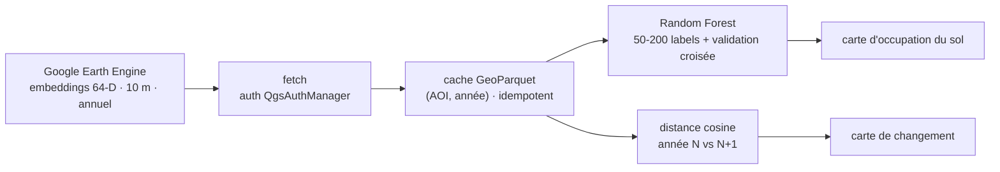
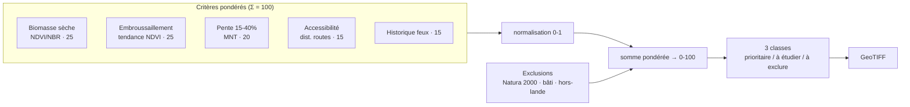
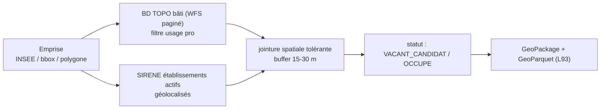
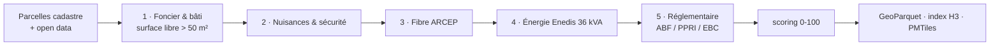
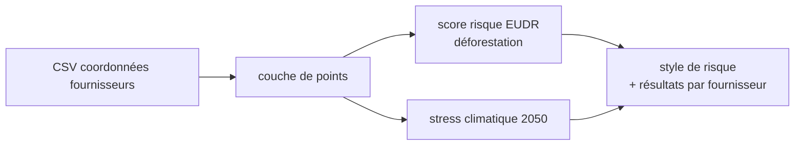
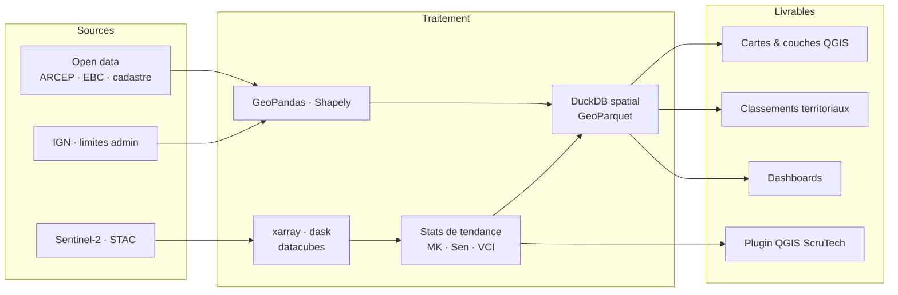

<picture>
  <source media="(prefers-color-scheme: dark)" srcset="assets/banner-dark.svg">
  
</picture>

## 🧭 À propos

Développeur **géomatique & data engineering** : j'analyse des territoires à partir de données
géospatiales — imagerie satellite, open data, cadastre — avec un objectif constant : des
**pipelines reproductibles, testés et cartographiables** plutôt que des scripts jetables.

- 🐍 Écosystème Python SIG : GeoPandas, Shapely, PostGIS, **DuckDB spatial**, GeoParquet, QGIS
- 🛰️ Télédétection & datacubes : STAC, Sentinel-2, xarray/dask, odc-stac, rasterio
- 📈 Statistiques de tendance : Mann-Kendall, pente de Sen, anomalies & VCI
- 🧪 Qualité : pytest, ruff, mypy, pre-commit, intégration continue GitHub Actions

## 🗂️ ScruTech — une plateforme, sept piliers, un socle commun

Tous les projets ci-dessous sont des **piliers d'une même plateforme** (`scrutech/`). Ils
partagent un **socle `core`** — une emprise (**AOI**) en entrée, le reste dérive : I/O
GeoParquet, base **DuckDB spatial**, layout de stockage `aoi=…/produit/`. Principe directeur :
**le backend calcule, QGIS lit** — le même moteur tourne en CLI, en batch, ou en un clic via le
plugin QGIS Processing.

```mermaid
flowchart TB
    subgraph Socle["🧱 Socle core — partagé par tous les piliers"]
        AOI["resolve_aoi<br/>une emprise = une analyse"]
        IO["io · lecture/écriture GeoParquet"]
        DB["db · DuckDB spatial"]
        ST["storage · layout aoi=.../produit/"]
        AOI --> IO --> DB --> ST
    end
    Socle --> P
    subgraph P["🌐 Piliers d'analyse"]
        V["🌿 VegeVigie"]
        AE["🛰️ AlphaEarth"]
        PA["🔥 PAF · WUI"]
        EC["🌾 Écobuage"]
        SD["🏚️ SDBPi"]
        MD["🏢 Mini data centers"]
        CR["🌍 Climate Risk"]
    end
    P --> QGIS["🧩 Plugin QGIS ScruTech<br/>Processing · 1 clic"]
    P --> WEB["🗺️ Couches · dashboards · WebGIS"]
```

**💡 En clair** : une seule « boîte à outils » géo. On lui donne une zone sur la carte, elle va
chercher la donnée (satellite ou open data), calcule, et renvoie des couches prêtes à ouvrir
dans QGIS. Chaque pilier répond à une question métier différente, mais tous s'appuient sur les
mêmes fondations.

---

### 🌿 VegeVigie — sentinelle de la végétation

Surveille la santé de la végétation à partir d'une décennie d'images **Sentinel-2** : NDVI →
composites mensuels → **tendances significatives** (Mann-Kendall + Sen) → **stress hydrique**
(anomalies, VCI) → **classement par commune**.

```mermaid
flowchart LR
    A["STAC · Sentinel-2 L2A"] --> B["Datacube xarray<br/>masquage nuages SCL"]
    B --> C["NDVI · composites mensuels"]
    C --> D["Tendances MK + Sen"]
    C --> E["Sécheresse · anomalies + VCI"]
    D --> F["Stats communales<br/>DuckDB · GeoParquet"]
    E --> F
    F --> G["Cartes QGIS · dashboard"]
```

**⚙️ Technique** — recherche STAC (Planetary Computer) → datacube `xarray`/`dask`, masque
nuages via bande SCL → NDVI → composites mensuels médians (comble les trous courts) →
Mann-Kendall + pente de Sen **par pixel** (vectorisé, validé contre `pymannkendall`) → anomalies
NDVI (z-score) + VCI → agrégation zonale et ranking DuckDB. CLI `typer` idempotente et cachée
(`aoi → search → cube → ndvi → trend → drought → zonal`), **60+ tests** hors-ligne.
**💡 En clair** — est-ce que la forêt verdit ou dépérit, où, et à quel point souffre-t-elle de
la sécheresse ? On empile 10 ans de photos satellite d'un même lieu et on mesure la pente : ça
monte (verdissement) ou ça descend (brunissement), commune par commune.

➡️ [Code, démos et méthodologie](scrutech/vegevigie/) · [Plugin QGIS ScruTech](scrutech/vegevigie/qgis_plugin/)

---

### 🛰️ AlphaEarth — empreintes satellite (Google DeepMind)

Utilise les **embeddings satellite** `SATELLITE_EMBEDDING/V1` (64 dimensions par pixel, annuel,
10 m) servis sur **Google Earth Engine** comme moteur de classification d'occupation du sol et
de **détection de changement** — complément « signature riche » de VegeVigie.

```mermaid
flowchart LR
    A["Google Earth Engine<br/>embeddings 64-D · 10 m · annuel"] --> B["fetch<br/>auth QgsAuthManager"]
    B --> C["cache GeoParquet<br/>(AOI, année) · idempotent"]
    C --> D1["Random Forest<br/>50-200 labels + validation croisée"]
    C --> D2["distance cosine<br/>année N vs N+1"]
    D1 --> E["carte d'occupation du sol"]
    D2 --> F["carte de changement"]
```

**⚙️ Technique** — `client` : requête GEE, auth par **QgsAuthManager** (jamais de clé en dur),
estimation du coût quota. `store` : cache GeoParquet par (AOI, année) avec provenance.
`classifier` : Random Forest sur les 64 features, **validation croisée obligatoire**. `change` :
distance cosine entre deux années (un vrai changement de surface, pas un artefact atmosphérique).
Deps lourdes (`earthengine-api`, `scikit-learn`) → **pilier optionnel**, interpréteur externe.
**💡 En clair** — Google a déjà « résumé » chaque pixel de la planète en 64 chiffres qui
capturent sa nature (forêt, eau, bâti…). On s'en sert pour classer le territoire avec très peu
d'exemples, et pour repérer ce qui a changé d'une année sur l'autre.

➡️ [Moteur AlphaEarth](scrutech/alphaearth/)

---

### 🔥 PAF — interface habitat-forêt (WUI)

Pilier « feu ». Calcule la **frontière forêt↔bâti** — la géométrie la plus critique de
l'incendie : débroussaillement légal (OLD 50 m), chaleur radiante et sautes de braises se jouent
tous dans une bande étroite autour de cette ligne.

```mermaid
flowchart LR
    A["Forêt (VégéVigie)"] --> U["union + reprojection L93"]
    B["Bâti"] --> R["buffer contact_m<br/>OLD 50 m"]
    U --> L["frontière = lisière ∩ portée<br/>interface_line"]
    R --> L
    U --> Z["bande OLD = forêt ∩ portée<br/>interface_zone"]
    R --> Z
    L --> O["métriques + GeoParquet / GeoJSON"]
    Z --> O
```

**⚙️ Technique** — cœur pur GeoPandas/Shapely : union des forêts et du bâti en CRS métrique
(L93), buffer `contact_m` autour du bâti, `boundary ∩ buffer` = ligne d'interface,
`forêt ∩ buffer` = bande OLD à traiter ; métriques (km de frontière, ha de bande, bâti exposé) ;
exports GeoParquet (L93) + GeoJSON (WGS84) pour le WebGIS. Intégré au moteur `vegevigie`.
**💡 En clair** — où la forêt touche-t-elle les maisons ? C'est là que ça brûle et qu'on est
légalement obligé de débroussailler. L'outil trace cette ligne de contact et la bande de 50 m à
défendre.

➡️ [Conception, schéma & doc PAF](scrutech/paff/)

---

### 🌾 Écobuage — aptitude au brûlage dirigé

Analyse **multicritère** pour hiérarchiser les zones de brûlage dirigé en milieu pastoral :
combine biomasse, embroussaillement, pente, accès et historique feux en un score d'aptitude.

```mermaid
flowchart LR
    subgraph C["Critères pondérés (Σ = 100)"]
      C1["Biomasse sèche<br/>NDVI/NBR · 25"]
      C2["Embroussaillement<br/>tendance NDVI · 25"]
      C3["Pente 15-40%<br/>MNT · 20"]
      C4["Accessibilité<br/>dist. routes · 15"]
      C5["Historique feux · 15"]
    end
    C --> N["normalisation 0-1"]
    N --> W["somme pondérée → 0-100"]
    X["Exclusions<br/>Natura 2000 · bâti · hors-lande"] --> W
    W --> K["3 classes<br/>prioritaire / à étudier / à exclure"]
    K --> G["GeoTIFF"]
```

**⚙️ Technique** — pile de rasters-critères alignés (même grille/CRS), chacun ramené en 0-1
puis pondéré (poids sommant à 100) ; masque d'exclusion dur (Natura 2000, proximité bâti, hors
landes/parcours) → score 0. `aptitude()` fait la somme pondérée, `classify()` applique les seuils
(≥66 / 33-66 / <33). Réutilise les indices VegeVigie (NDVI, NBR, tendance). Export GeoTIFF.
**💡 En clair** — sur quelles parcelles pastorales le brûlage contrôlé est-il pertinent et sûr ?
On note chaque zone de 0 à 100 selon la végétation, la pente, l'accès et les enjeux, puis on trie
en trois catégories.

➡️ [Méthodologie & moteur de scoring](scrutech/ecobuage/)

---

### 🏚️ SDBPi — bâtiments professionnels inoccupés

Croise **BD TOPO (bâti) × SIRENE (activité)** : un bâtiment commercial/industriel sans
établissement actif géolocalisé à proximité est un **candidat à l'inoccupation** (méthode type
Cerema).

```mermaid
flowchart LR
    A["Emprise<br/>INSEE / bbox / polygone"] --> B["BD TOPO bâti (WFS paginé)<br/>filtre usage pro"]
    A --> C["SIRENE établissements actifs<br/>géolocalisés"]
    B --> J["jointure spatiale tolérante<br/>buffer 15-30 m"]
    C --> J
    J --> S["statut : VACANT_CANDIDAT / OCCUPE"]
    S --> O["GeoPackage + GeoParquet (L93)"]
```

**⚙️ Technique** — acquisition paginée WFS BD TOPO (COUNT plafonné → `STARTINDEX`) + SIRENE
(partition par section NAF pour contourner le plafond 10 000, source de masse Grand Lyon en
alternative) ; filtre usage pro ; jointure spatiale tolérante au buffer (la géoloc SIRENE est à
l'adresse BAN, décalée du footprint) ; `statut_occupation`. Testé sur Bourg-en-Bresse et une
emprise Grand Lyon (**19 572 bâtiments pro**, analyse de sensibilité au buffer).
**💡 En clair** — quels locaux commerciaux ou industriels semblent vides ? On regarde s'il existe
une entreprise active enregistrée à cette adresse ; si non, le bâtiment est un candidat à
vérifier sur le terrain (pas une certitude).

➡️ [Pipeline & résultats](scrutech/sdbpi/)

---

### 🏢 Mini data centers résidentiels — sélection de sites

Méthodologie de **scoring de parcelles cadastrales** pour implanter des mini data centers
résidentiels : cinq filtres spatiaux successifs, pensée coût-d'abord et cloud-native.

```mermaid
flowchart LR
    A["Parcelles cadastre<br/>+ open data"] --> F1["1 · Foncier & bâti<br/>surface libre > 50 m²"]
    F1 --> F2["2 · Nuisances & sécurité"]
    F2 --> F3["3 · Fibre ARCEP"]
    F3 --> F4["4 · Énergie Enedis 36 kVA"]
    F4 --> F5["5 · Réglementaire<br/>ABF / PPRI / EBC"]
    F5 --> S["scoring 0-100"]
    S --> O["GeoParquet · index H3 · PMTiles"]
```

**⚙️ Technique** — cible cloud-native : dbt-duckdb spatial → GeoParquet partitionné (par
département) → index **H3** (r9) + R-tree DuckDB → PMTiles. Cinq filtres (foncier, nuisances,
fibre ARCEP, énergie Enedis, réglementaire) → score 0-100. Approche coût-d'abord (140 M parcelles
via grille H3), validation spatiale stricte (`ST_IsValid`, CV spatiale et non K-Fold classique).
Analyse réelle multi-axes sur **Alba-la-Romaine** (export GeoPackage + styles QML).
**💡 En clair** — où peut-on poser un petit data center chez des particuliers ? On élimine
successivement les parcelles impossibles (trop petites, sans fibre, sans électricité suffisante,
interdites), puis on note celles qui restent.

➡️ [Méthodologie, prompts SIG et outil](scrutech/mini_dc/)

---

### 🌍 Climate Risk Analyzer (EUDR) — *fondation v0.1*

Plugin QGIS d'évaluation du **risque de déforestation EUDR** et du **stress climatique 2050**
pour des localisations de fournisseurs (supply chain / ESG).

```mermaid
flowchart LR
    A["CSV coordonnées fournisseurs"] --> B["couche de points"]
    B --> C["score risque EUDR<br/>déforestation"]
    B --> D["stress climatique 2050"]
    C --> E["style de risque<br/>+ résultats par fournisseur"]
    D --> E
```

**⚙️ Technique** — plugin QGIS : import CSV → couche de points temporaire → scores EUDR + climat
(**mock** pour l'instant) → style de risque → tableau par fournisseur. Statut : fondation
(v0.1.0, `experimental`) — le branchement sur les vraies sources (Hansen/GFC, projections
climatiques) reste à faire.
**💡 En clair** — mes fournisseurs sont-ils installés sur des zones récemment déboisées ou
menacées par le climat en 2050 ? Prototype qui pose la chaîne ; les scores réels viendront.

➡️ [Plugin Climate Risk](scrutech/climate_risk_analyzer/)

## 🔬 Analyses en images

Figures produites par le vrai code du pipeline VegeVigie (démos sur données synthétiques,
reproductibles via `vegevigie run --small`) :

<table>
  <tr>
    <td align="center" width="50%">
       
      <b>Tendances par pixel</b> — verdissement/brunissement, Mann-Kendall + pente de Sen
    </td>
    <td align="center" width="50%">
       
      <b>Stress hydrique</b> — anomalies NDVI (z-score) et indice VCI
    </td>
  </tr>
  <tr>
    <td align="center" width="50%">
       
      <b>Classement communal</b> — agrégation zonale et requêtes DuckDB
    </td>
    <td align="center" width="50%">
       
      <b>Séries temporelles</b> — composites NDVI mensuels, robustes aux nuages
    </td>
  </tr>
</table>

## 📊 Statistiques du dépôt

Chiffres et graphiques **générés automatiquement toutes les 48 h** depuis l'historique Git
réel (script [`scripts/generate_stats.py`](scripts/generate_stats.py), sans dépendance externe).

<!-- AUTO-STATS:START -->
| 📦 Commits | 📅 Jours actifs | 🗂️ Projets |
|:---:|:---:|:---:|
| **76** | **31** | **1** |

| 🐍 Lignes de Python | ✅ Tests automatisés | 🥇 Langage principal |
|:---:|:---:|:---:|
| **15 375** | **142** | **Python (72,1 %)** |

*Dernière mise à jour automatique : 3 septembre 2026 à 13:42 (heure de Paris) — commit `0e978e3`.*
<!-- AUTO-STATS:END -->

<picture>
  <source media="(prefers-color-scheme: dark)" srcset="assets/activity-dark.svg">
  
</picture>

<table>
  <tr>
    <td width="50%">
      <picture>
        <source media="(prefers-color-scheme: dark)" srcset="assets/languages-dark.svg">
        
      </picture>
    </td>
    <td width="50%">
      <picture>
        <source media="(prefers-color-scheme: dark)" srcset="assets/weekdays-dark.svg">
        
      </picture>
    </td>
  </tr>
</table>

## 🛠️ La stack en un schéma

```mermaid
flowchart LR
    subgraph Sources
        S1[Sentinel-2 · STAC]
        S2[IGN · limites admin]
        S3[Open data<br/>ARCEP · EBC · cadastre]
    end
    subgraph Traitement
        T1[xarray · dask<br/>datacubes]
        T2[GeoPandas · Shapely]
        T3[Stats de tendance<br/>MK · Sen · VCI]
        T4[DuckDB spatial<br/>GeoParquet]
    end
    subgraph Livrables
        L1[Cartes & couches QGIS]
        L2[Classements territoriaux]
        L3[Dashboards]
        L4[Plugin QGIS ScruTech]
    end
    S1 --> T1 --> T3 --> T4
    S2 --> T2 --> T4
    S3 --> T2
    T4 --> L1 & L2 & L3
    T3 --> L4
```

## ⚙️ Automatisation du portfolio

Cette page s'entretient toute seule : un workflow GitHub Actions
([`portfolio.yml`](.github/workflows/portfolio.yml)) tourne **tous les deux jours**, régénère
statistiques et graphiques SVG (thèmes clair/sombre) depuis l'historique Git, puis committe le
résultat — un commit d'activité est créé même sans changement.

```mermaid
flowchart LR
    A([⏰ cron · 48 h]) --> B[generate_stats.py<br/>lecture de l'historique Git]
    B --> C[SVG clair/sombre<br/>+ tableau de stats]
    C --> D[Commit & push]
    D --> E([README toujours à jour])
```

## 🗺️ Carte détaillée des scripts

Cette section liste **chaque script Python du dépôt**, pilier par pilier, avec son nom de
fichier d'origine entre parenthèses et son rôle expliqué en langage simple. Objectif : que
n'importe qui (même sans lire le code) comprenne à quoi sert chaque fichier avant d'aller y
regarder. Le code lui-même est commenté en français pour un niveau Python intermédiaire :
chaque fonction non triviale explique son « pourquoi », pas juste son « quoi ».

<b>🧱 Socle commun — <code>scrutech/core/</code></b> (utilisé par tous les piliers)

| Fichier (nom original) | Rôle en langage simple |
|---|---|
| `src/core/aoi.py` | **Le cœur du principe « AOI-first »** : transforme n'importe quelle façon de désigner une zone d'étude (code INSEE, département, rectangle de coordonnées, fichier, ou déjà un objet zone) en un objet `Aoi` unique et stable. Va aussi chercher les contours de communes sur l'API officielle du gouvernement. |
| `src/core/constants.py` | Les deux systèmes de coordonnées utilisés partout (WGS84 = GPS/degrés, Lambert-93 = mètres pour la France) et le type `BBox` (rectangle englobant). |
| `src/core/db.py` | Ouvre et interroge la base de données centrale **DuckDB** (un seul fichier, pas de serveur) qui stocke les résultats de tous les piliers ; écrit les résultats de façon « idempotente » (relancer un calcul ne crée jamais de doublons). |
| `src/core/io.py` | Le lecteur/écrivain de fichiers vecteur unique (remplace 3 fonctions presque identiques qui existaient avant dans différents piliers) : lit du GeoParquet ou tout autre format SIG classique. |
| `src/core/sources.py` | Va chercher automatiquement, à partir d'une simple zone d'étude, les données officielles nécessaires : bâtiments, forêts, routes (BD TOPO de l'IGN) et zones protégées (Natura 2000, ZNIEFF). |
| `src/core/storage.py` | Définit **où** chaque résultat est rangé sur le disque (un chemin standard par pilier/zone/produit) et fournit des fonctions pour retrouver ou recopier les résultats déjà calculés. |

<b>🌿 VegeVigie — <code>scrutech/vegevigie/</code></b> (pilier principal, le plus mature)

*Moteur (`src/vegevigie/`) :*

| Fichier (nom original) | Rôle en langage simple |
|---|---|
| `cli.py` | La **ligne de commande** de VegeVigie (`vegevigie run ...`) : l'endroit où on lance toute la chaîne de calcul depuis un terminal. |
| `config.py` | Lit et valide la configuration (fichier YAML) : quelle zone, quelles dates, quels seuils. |
| `aoi.py` | Fonctions spécifiques à VegeVigie pour préparer la zone d'étude avant analyse. |
| `catalog.py` | Cherche les images satellite Sentinel-2 disponibles pour la zone et la période, via le catalogue **STAC**. |
| `datacube.py` | Construit le « cube de données » (empilement d'images dans le temps) à partir des scènes trouvées, avec `xarray`/`dask` pour ne charger en mémoire que ce qui est nécessaire. |
| `indices.py` | Calcule le **NDVI** (indice de végétation) pixel par pixel et masque les nuages. |
| `composite.py` | Fusionne plusieurs images d'un même mois en une seule image « composite » (médiane), pour combler les trous dus aux nuages. |
| `seasonal.py` | Retire l'effet des saisons (été/hiver) de la série NDVI avant de chercher une tendance, pour ne pas confondre saisonnalité normale et vraie évolution. |
| `trend.py` | **Le résultat phare** : détecte, pixel par pixel, si la végétation verdit ou brunit sur plusieurs années (test de Mann-Kendall + pente de Sen). |
| `breaks.py` | Détecte à quel moment précis une série a « cassé » (rupture brutale), une version simplifiée de l'algorithme BFAST. |
| `drought.py` | Détecte le stress hydrique : anomalies NDVI et indice de sécheresse VCI. |
| `zonal.py` | Résume les résultats raster (tendance, sécheresse) par commune (agrégation zonale). |
| `store.py` | Sauvegarde les résultats en GeoParquet et les interroge/classe via DuckDB. |
| `pipeline.py` | **L'orchestrateur** : enchaîne toutes les étapes ci-dessus dans le bon ordre (recherche → cube → NDVI → tendance → sécheresse → zonal), avec mise en cache pour ne jamais refaire un calcul déjà fait. |
| `qgis_runner.py` | Point d'entrée qui permet au plugin QGIS de lancer ce pipeline dans un **processus Python séparé** (QGIS a son propre Python, incompatible avec les grosses bibliothèques scientifiques). |
| `interface.py` | Calcule la ligne de contact entre forêt et bâti (interface habitat-forêt), utilisée par le pilier PAF. |
| `biotrame_aoi.py` | Version « zone d'étude seule » du pilier Biotrame (maillage hexagonal écologique), intégrée au moteur VegeVigie. |
| `ecobuage_aoi.py` | Version « zone d'étude seule » du pilier Écobuage (aptitude au brûlage dirigé). |
| `dashboard/app.py`, `dashboard/data.py` | Le **tableau de bord public** (Streamlit + carte interactive leafmap) qui affiche les résultats sans avoir besoin de QGIS. |
| `report/app.py`, `report/data.py` | Une page de **rapport visuel** qui résume automatiquement un dossier de résultats déjà calculé. |

*Démos pédagogiques (`scripts/demo_*.py`)* — génèrent les images du README à partir de données **synthétiques** (inventées), sans appel réseau, pour que n'importe qui puisse reproduire les figures :
`demo_ndvi_masking.py` (masquage nuages), `demo_monthly_ndvi.py` (composites mensuels), `demo_trend_map.py` (carte de tendance), `demo_drought.py` (sécheresse), `demo_zonal_ranking.py` (classement communes), `demo_dashboard_data.py` (données du tableau de bord).

*Plugin QGIS (`qgis_plugin/`)* — la version « bouton dans QGIS » de tous les piliers :

| Fichier (nom original) | Rôle en langage simple |
|---|---|
| `scrutech/scrutech_plugin.py` | Le point d'entrée que QGIS charge au démarrage du plugin. |
| `scrutech/provider.py` | Enregistre la liste des algorithmes ScruTech dans la boîte à outils « Processing » de QGIS. |
| `scrutech/dependencies.py` | Vérifie que les bibliothèques scientifiques nécessaires sont bien installées avant de lancer un calcul. |
| `algorithms/analyze_extent.py` | Bouton « 1 clic » : tendance de végétation + sécheresse sur une emprise. |
| `algorithms/paf_interface.py`, `algorithms/paf_interface_aoi.py` | Bouton pour calculer l'interface forêt/bâti (PAF). |
| `algorithms/ecobuage_aptitude.py`, `algorithms/ecobuage_aptitude_aoi.py` | Bouton pour le score d'aptitude au brûlage dirigé (Écobuage). |
| `algorithms/biotrame_priority.py` | Bouton pour le maillage hexagonal de priorité écologique (Biotrame). |
| `algorithms/mini_dc_sites.py` | Bouton pour la sélection de sites de mini data centers. |
| `algorithms/sdbpi_vacance.py` | Bouton pour la détection de bâtiments professionnels vacants. |
| `algorithms/alphaearth_change.py` | Bouton pour la détection de changement par embeddings satellite AlphaEarth. |
| `algorithms/load_cached.py` | Charge un résultat déjà calculé, sans tout relancer. |
| `algorithms/load_communes.py` | Charge les contours de communes comme couche de zones. |
| `algorithms/report_launch.py` | Lance le rapport visuel Streamlit depuis QGIS. |
| `algorithms/_external.py` | Fait tourner le moteur lourd (hors QGIS) dans un interpréteur Python externe. |
| `algorithms/_venv.py` | Trouve ou crée cet interpréteur Python externe automatiquement. |
| `algorithms/_qgis_compat.py` | Petite couche de compatibilité pour que le code marche sur QGIS 3 **et** QGIS 4. |
| `algorithms/_icons.py`, `algorithms/_styles.py` | Icônes et styles de couleur (charte graphique ScruTech) appliqués aux boutons et aux résultats. |
| `deploy_plugin.py` | Construit le plugin et le dépose directement dans le dossier de plugins de QGIS (pour tester en local). |
| `package.py` | Empaquette le plugin en `.zip` installable (pour le distribuer). |

<b>🛰️ AlphaEarth — <code>scrutech/alphaearth/</code></b>

| Fichier (nom original) | Rôle en langage simple |
|---|---|
| `client.py` | Interroge Google Earth Engine pour récupérer les embeddings satellite (authentification sécurisée via QGIS, jamais de clé écrite en dur). |
| `store.py` | Sauvegarde localement (cache GeoParquet) ce qui a déjà été téléchargé, pour ne pas re-télécharger deux fois la même zone/année. |
| `classifier.py` | Classifie l'occupation du sol à partir des embeddings avec un algorithme de Machine Learning (Random Forest). |
| `change.py` | Détecte un changement entre deux années en mesurant la « distance » mathématique entre leurs embeddings. |
| `pipeline.py` | Orchestrateur : zone d'étude + deux années en entrée → carte de changement en sortie. |
| `_columns.py` | Simple liste des noms des 64 colonnes numériques qui composent un embedding. |

<b>🐝 Biotrame — <code>scrutech/biotrame/</code></b> (priorisation écologique par maillage hexagonal)

| Fichier (nom original) | Rôle en langage simple |
|---|---|
| `mesh.py` | Découpe la zone d'étude en une grille d'hexagones réguliers (norme H3 utilisée par Uber puis largement adoptée en géodonnées). |
| `aggregate.py` | Calcule, pour chaque hexagone, des indicateurs (proximité de zones protégées, etc.). |
| `score.py` | Combine ces indicateurs en un score de priorité écologique par hexagone. |

<b>🏚️ SDBPi — <code>scrutech/sdbpi/</code></b> (bâtiments professionnels inoccupés)

| Fichier (nom original) | Rôle en langage simple |
|---|---|
| `config.py` | Paramètres centraux du POC (rayon de recherche, seuils...). |
| `net.py` | Couche réseau : requêtes HTTP robustes avec nouvelles tentatives automatiques en cas d'échec. |
| `sources.py` | Télécharge (avec mise en cache locale) les bâtiments BD TOPO et les entreprises SIRENE. |
| `processing.py` | Le calcul lui-même : croise bâtiments et entreprises actives pour repérer les candidats à la vacance. |
| `run_vacance.py` | Point d'entrée qui enchaîne acquisition → traitement → export pour une commune donnée. |

<b>🏢 Mini data centers — <code>scrutech/mini_dc/outil/</code></b> (sélection de sites)

| Fichier (nom original) | Rôle en langage simple |
|---|---|
| `config.py` | Paramètres centraux de l'outil (seuils de surface, distances...). |
| `db.py` | Connexion à la base DuckDB et chargement de son extension géospatiale. |
| `telecharge_arcep.py` | Télécharge les données de couverture fibre (ARCEP, open data). |
| `telecharge_ebc.py` | Télécharge les zones classées « Espaces Boisés Classés » d'une commune (contrainte réglementaire). |
| `generate_synthetic.py` | Fabrique un jeu de données **inventé** mais réaliste pour tester le pipeline sans dépendre de vraies données. |
| `adapter_donnees_reelles.py` | Convertit des données publiques réelles vers le format attendu par le pipeline. |
| `pipeline.py` | **Le cœur de l'outil** : applique successivement les 5 filtres (foncier, nuisances, fibre, énergie, réglementaire) puis calcule un score. |
| `analyse_reelle.py` | Lance l'analyse complète sur un vrai cas d'étude (Alba-la-Romaine). |
| `run.py` | Point d'entrée unique qui orchestre tout l'outil. |
| `tests_pipeline.py` | Script de validation qui vérifie que les résultats du pipeline sont cohérents (pas un test `pytest` classique, un script de contrôle qualité). |

<b>🔥 PAF, 🌾 Écobuage, 🌍 Climate Risk, 💾 Storage — piliers plus légers

| Fichier (nom original) | Rôle en langage simple |
|---|---|
| `scrutech/paff/reference/interface.py` | Calcule la ligne de contact entre forêt et zones bâties (interface habitat-forêt), et la bande de 50 m à débroussailler autour. |
| `scrutech/ecobuage/ecobuage.py` | Combine plusieurs critères pondérés (biomasse, pente, accès...) en un score d'aptitude au brûlage dirigé, puis classe les zones en 3 catégories. |
| `scrutech/climate_risk_analyzer/eudr_climate_risk_analyzer/eudr_analyzer_plugin.py` | Logique principale du plugin QGIS : importe des coordonnées fournisseurs et calcule un score de risque (déforestation EUDR, stress climatique). |
| `scrutech/climate_risk_analyzer/eudr_climate_risk_analyzer/eudr_analyzer_dialog.py` | La fenêtre/formulaire affichée à l'utilisateur dans QGIS. |
| `scrutech/storage/init_db.py` | Crée (ou met à jour) la base DuckDB centrale et affiche ce qu'elle contient. |
| `scrutech/storage/download_aura.py` | Télécharge le cache de données pré-calculées pour la région Auvergne-Rhône-Alpes. |
| `scrutech/apprentissage/ndvi_a_la_main.py` | Script **pédagogique** : recalcule un NDVI « à la main », étape par étape, pour comprendre le calcul sans boîte noire. |

<b>🧩 Plugin QGIS (scaffold v2) — <code>scrutech/plugin/</code></b> (spécification future, pas encore branchée en production)

| Fichier (nom original) | Rôle en langage simple |
|---|---|
| `core/auth_manager.py` | Stocke les clés d'API de façon sécurisée (jamais en clair sur le disque). |
| `core/cache_manager.py` | Cache local avec taille limitée, pour ne jamais télécharger une scène satellite entière sans prévenir. |
| `core/cog_reader.py` | Lit des images satellite « Cloud-Optimized GeoTIFF » en streaming, sans tout télécharger d'un coup. |
| `core/h3_indexer.py` | Indexe les zones de recherche avec la grille hexagonale H3. |
| `core/job_runner.py` | Fait tourner les appels réseau en tâche de fond dans QGIS, sans geler l'interface. |
| `core/stac_client.py` | Cherche des images satellite sur plusieurs catalogues STAC à la fois. |
| `processing/indices.py` | Calcule les indices spectraux (NDVI, NDWI...). |
| `processing/atmospheric_correction.py` | Corrige les effets de l'atmosphère sur les images satellite. |
| `processing/change_detection.py` | Détection de changement avancée (algorithmes CCDC/BFAST). |
| `processing/inference.py` | Fait tourner un modèle d'IA pré-entraîné (foundation model) sur les images. |
| `ui/search_panel.py` | Panneau de recherche d'images dans l'interface du plugin. |
| `ui/preview_widget.py` | Aperçu miniature d'une image avant de la charger en pleine résolution. |
| `ui/job_monitor.py` | Suivi visuel des tâches en cours (progression, logs, coût API estimé). |
| `ui/api_keys_dialog.py` | Formulaire pour saisir ses clés d'API. |

<b>⚙️ Automatisation — <code>scripts/</code></b>

| Fichier (nom original) | Rôle en langage simple |
|---|---|
| `generate_stats.py` | Lit l'historique Git du dépôt et régénère automatiquement les statistiques et les graphiques SVG affichés en haut de ce README. |

## 📫 Contact

- GitHub : [@BastienLebrou](https://github.com/BastienLebrou)
- E-mail : [bastienlebrou1@gmail.com](mailto:bastienlebrou1@gmail.com)

Les statistiques et visuels de cette page sont calculés depuis l'historique Git réel du
dépôt — rien n'est saisi à la main.
