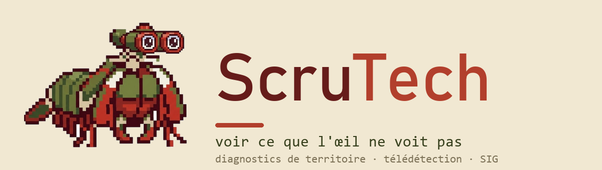
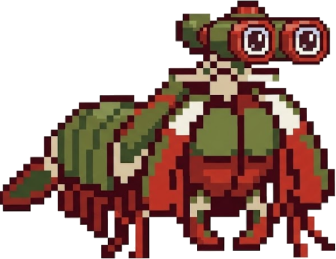
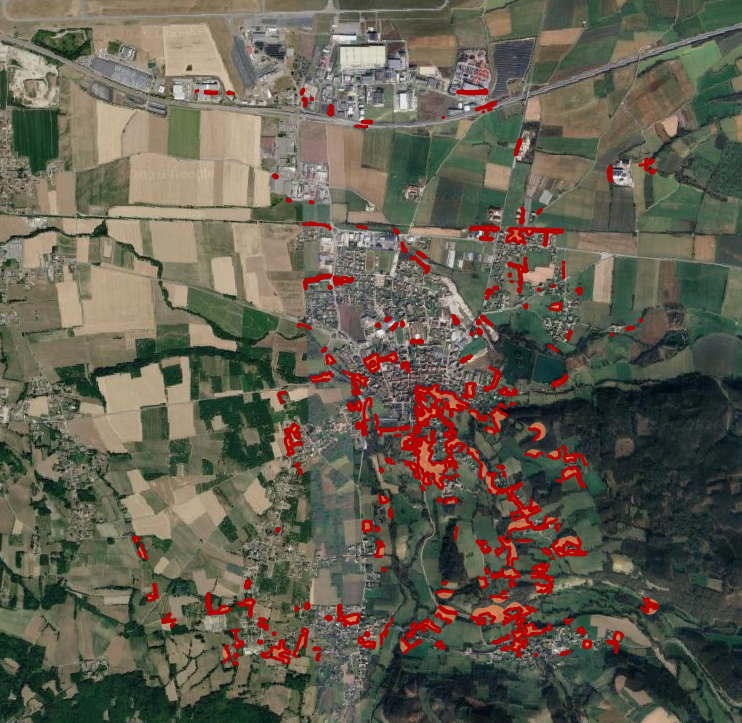
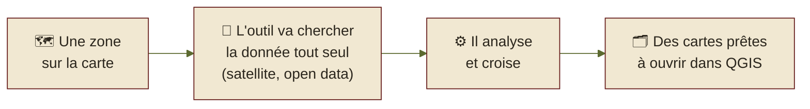

<picture>
  <source media="(prefers-color-scheme: dark)" srcset="assets/mantis-banner-dark.png">
  
</picture>

  

### Bastien Lebrou

**Je fais parler les cartes.** J'analyse des territoires à partir d'images satellites et de
données publiques pour répondre à des questions concrètes.

`Portfolio géomatique & données` · `projet personnel` · `open source`

## En deux mots

Le cartographe lit le territoire couche après couche. Mais sous ces couches, des **données
invisibles le façonnent**. **ScruTech** met la technologie au cœur du regard pour les rendre
lisibles : on lui désigne une zone sur la carte, elle va chercher la donnée toute seule
(satellite, open data), l'analyse, et rend des **cartes prêtes à décider**.

Chaque outil répond à **une question**. VegeVigie, Écobuage, Mini DC… **ne sont que des
outils** d'une seule et même plateforme.

> 🧭 Tu explores le code ? Commence par le [**guide du dépôt**](GUIDE.md) : pour chaque outil, il
> dit quel fichier ouvrir et ce qu'il fait.

## Mantis, le regard du projet

<table>
  <tr>
    <td width="34%" align="center">
      
    </td>
    <td>

**Mantis, la crevette-mante.** Son système visuel est le plus complexe du règne animal : seize
types de photorécepteurs (contre trois chez l'humain), l'ultraviolet, la lumière polarisée. Elle
perçoit ce que nous ne voyons pas.

C'est exactement le geste de ScruTech : révéler les **forces invisibles qui façonnent le
territoire**. Mantis est la mascotte-guide du projet — elle présente, vulgarise et relie les
outils, jumelles à la main.

  </td>
  </tr>
</table>

## Un aperçu, en images

La carte ci-dessous est une vraie sortie de l'outil sur une zone en Ardèche. Chaque hexagone
est une petite zone du territoire, coloriée selon son importance pour la nature : **en rouge**,
les zones prioritaires ; **en orange**, celles à regarder de plus près ; **en gris**, le reste.

  

<table>
  <tr>
    <td align="center" width="50%">
       
      <b>La forêt verdit-elle ou dépérit-elle ?</b> Vert = ça pousse, rouge = ça décline
    </td>
    <td align="center" width="50%">
       
      <b>Où la végétation a-t-elle soif ?</b> Les zones en stress hydrique ressortent
    </td>
  </tr>
  <tr>
    <td align="center" width="50%">
       
      <b>Quelles communes surveiller ?</b> Un classement, commune par commune
    </td>
    <td align="center" width="50%">
       
      <b>Comment ça évolue dans le temps ?</b> La santé de la végétation, mois après mois
    </td>
  </tr>
</table>

PAF trace la même logique sur un autre risque : où la forêt touche-t-elle vraiment les
habitations, là où le débroussaillement devient obligatoire.

  

  <b>Où la forêt touche-t-elle les habitations ?</b> En rouge, l'interface habitat-forêt calculée par l'outil

## Les outils, une question chacun

| | Outil | La question à laquelle il répond | Statut |
|:---:|---|---|:---:|
| 🌿 | **VegeVigie** | La forêt se porte-t-elle bien ? En empilant dix ans de photos satellite, l'outil repère où la végétation pousse, où elle décline, et où elle souffre de la sécheresse. | Stable |
| 🕸️ | **Biotrame** | Où concentrer les efforts pour la nature ? En croisant tous les indicateurs sur une grille, l'outil met en avant les zones prioritaires (compensation écologique). | Bêta |
| 🛰️ | **AlphaEarth** | Qu'est-ce qui a changé sur le terrain d'une année à l'autre ? On s'appuie sur des « empreintes » satellite de Google pour classer le paysage et repérer les évolutions. | Bêta |
| 🔥 | **PAF** | Où le feu menace-t-il les maisons ? L'outil trace la ligne exacte où la forêt touche les habitations, là où le débroussaillement est obligatoire. | Expérimental |
| 🌾 | **Écobuage** | Quelles parcelles peut-on brûler sans danger ? Chaque zone reçoit une note selon la végétation, la pente, l'accès et les protections en place. | Expérimental |
| 🏚️ | **SDBPi** | Quels locaux commerciaux semblent vides ? On croise les bâtiments et les entreprises actives : pas d'entreprise enregistrée à l'adresse, bâtiment à vérifier. | Expérimental |
| 🏢 | **Mini data centers** | Où installer un petit data center chez des particuliers ? On écarte les terrains impossibles, puis on note ceux qui restent. | Expérimental |
| 🌍 | **Climate Risk** | Mes fournisseurs sont-ils sur des zones déboisées ou menacées par le climat ? Un prototype de conformité (réglementation européenne EUDR). | Prototype |

*Stable : API et méthode figées. Bêta : fonctionnel, interface encore mouvante. Expérimental /
Prototype : résultats à valider avant tout usage décisionnel.*

Chaque outil a sa propre page détaillée : [VegeVigie](scrutech/vegevigie/) ·
[Biotrame](scrutech/biotrame/) · [AlphaEarth](scrutech/alphaearth/) · [PAF](scrutech/paff/) ·
[Écobuage](scrutech/ecobuage/) · [SDBPi](scrutech/sdbpi/) ·
[Mini data centers](scrutech/mini_dc/) · [Climate Risk](scrutech/climate_risk_analyzer/).

## Comment ça marche

Toujours le même principe, quel que soit l'outil : on part d'une zone, on finit avec des cartes.

```mermaid
%%{init: {'theme':'base','themeVariables':{'primaryColor':'#F1E8D2','primaryBorderColor':'#661C1A','primaryTextColor':'#2B261D','lineColor':'#5C6A30','fontFamily':'IBM Plex Sans, Segoe UI, sans-serif'}}}%%
flowchart LR
    A["🗺️ Une zone<br/>sur la carte"] --> B["📡 L'outil va chercher<br/>la donnée tout seul<br/>(satellite, open data)"]
    B --> C["⚙️ Il analyse<br/>et croise"]
    C --> D["🗂️ Des cartes prêtes<br/>à ouvrir dans QGIS"]
```

Et tout se lance aussi **en un clic** depuis QGIS, le logiciel de cartographie que connaissent
les géomaticiens, grâce à une extension dédiée.

<b>🔧 Pour les curieux : sous le capot</b>

 

Rien n'est bricolé à la main : chaque analyse est un **programme reproductible**, testé, qu'on
peut relancer à l'identique. Les grands blocs techniques :

| Domaine | Outils employés |
|---|---|
| Images satellites & séries temporelles | Sentinel-2, STAC, xarray / dask, rasterio |
| Traitement de données géo | GeoPandas, Shapely, PostGIS, DuckDB spatial, GeoParquet |
| Statistiques de tendance | Mann-Kendall, pente de Sen, Pettitt, VCI |
| Analyse multicritère & maillage | scoring pondéré, grille hexagonale H3, connectivité |
| Restitution | extension QGIS, cartes, tableaux de bord, tuiles web |
| Qualité du code | plus de 150 tests automatisés, intégration continue, typage |

Le tout repose sur un **socle commun** (`core`) : une zone en entrée, et tout le reste en
découle (lecture / écriture des données, base spatiale, rangement des résultats). Pour trouver
n'importe quel script, voir le [**guide du dépôt**](GUIDE.md) ; la
[politique de sécurité](SECURITY.md) complète le tableau.

## Un test grandeur nature, en chiffres

Résultats d'un vrai passage de la chaîne complète sur une zone test de 5 communes en Isère
(Brézins, Plan, Saint-Étienne-de-Saint-Geoirs, Saint-Geoirs, Saint-Pierre-de-Bressieux —
environ 1 575 ha). Pas une simulation : ce sont les couches produites par les outils sur cette
zone.

| Outil | Ce qui a été mesuré |
|---|---|
| 🌿 **VegeVigie** | Sur les 1 575 ha : **41,5 % en hausse significative** de NDVI, **7,3 % en déclin significatif**, le reste sans tendance nette. Une rupture statistique (test de Pettitt) est détectée sur **54,9 % de la surface**, très majoritairement en **2020, 2021 et 2023** — les années de sécheresse marquée dans la région. **25 % de la surface (397 ha)** reste durablement au-dessus du seuil de stress hydrique. |
| 🕸️ **Biotrame** | Sur 1 023 hexagones (1 477 ha), seuls **9 hexagones (13 ha, 0,9 %)** ressortent en priorité maximale pour la compensation écologique, et **32 (46 ha, 3,1 %)** en priorité moyenne — le reste hors enjeu prioritaire. Une vraie sélection, pas une carte où tout est rouge. |
| 🔥 **PAF** | **47,6 km** d'interface habitat-forêt identifiés sur la zone, soit **49 ha** de bande à débroussailler obligatoirement. |
| 🌾 **Écobuage** | Aptitude moyenne **15,7/100** : seuls **5,9 % de la surface (93 ha)** dépassent le seuil favorable. Le détail par classe : 76,9 % exclu, 20,8 % moyen, **2,3 % (36 ha) réellement favorable au brûlage**. |

Le classement par commune (VegeVigie) montre des écarts nets : Plan ressort avec **64 % de
sa surface en verdissement** et l'anomalie moyenne la plus forte, contre 35 % pour Brézins ou
Saint-Pierre-de-Bressieux.

Zone de démonstration, pas un échantillon représentatif du territoire national — les
seuils (favorable/prioritaire/stress) sont ceux configurés par défaut dans chaque outil.

## Le projet en chiffres

Ces chiffres se mettent à jour **tout seuls, tous les deux jours**, à partir de l'historique réel
du projet.

<!-- AUTO-STATS:START -->
| 📦 Commits | 📅 Jours actifs | 🗂️ Projets |
|:---:|:---:|:---:|
| **121** | **44** | **1** |

| 🐍 Lignes de Python | ✅ Tests automatisés | 🥇 Langage principal |
|:---:|:---:|:---:|
| **18 325** | **179** | **Python (80,4 %)** |

*Dernière mise à jour automatique : 17 septembre 2026 à 14:04 (heure de Paris) — commit `ff89a96`.*
<!-- AUTO-STATS:END -->

<picture>
  <source media="(prefers-color-scheme: dark)" srcset="assets/activity-dark.svg">
  
</picture>

Voir la répartition des langages et des jours de travail

<table>
  <tr>
    <td width="50%">
      <picture>
        <source media="(prefers-color-scheme: dark)" srcset="assets/languages-dark.svg">
        
      </picture>
    </td>
    <td width="50%">
      <picture>
        <source media="(prefers-color-scheme: dark)" srcset="assets/weekdays-dark.svg">
        
      </picture>
    </td>
  </tr>
</table>

## Me contacter

Je cherche un poste de **géomaticien** (Métropole de Lyon ou en télétravail). Discutons-en.

- GitHub : [@BastienLebrou](https://github.com/BastienLebrou)
- E-mail : [bastienlebrou1@gmail.com](mailto:bastienlebrou1@gmail.com)

Mantis et l'identité visuelle sont maison. Les chiffres et graphiques sont calculés depuis
l'historique réel du projet — rien n'est saisi à la main.
