

<picture>
  <source media="(prefers-color-scheme: dark)" srcset="assets/banner-dark.svg">
  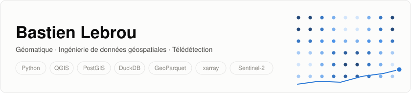
</picture>

## 🧭 À propos

Développeur **géomatique & data engineering** : j'analyse des territoires à partir de données
géospatiales — imagerie satellite, open data, cadastre — avec un objectif constant : des
**pipelines reproductibles, testés et cartographiables** plutôt que des scripts jetables.

- 🐍 Écosystème Python SIG : GeoPandas, Shapely, PostGIS, **DuckDB spatial**, GeoParquet, QGIS
- 🛰️ Télédétection & datacubes : STAC, Sentinel-2, xarray/dask, odc-stac, rasterio
- 📈 Statistiques de tendance : Mann-Kendall, pente de Sen, anomalies & VCI
- 🧪 Qualité : pytest, ruff, mypy, pre-commit, intégration continue GitHub Actions

## 🗂️ ScruTech — une plateforme, sept piliers, un socle commun

Tous les projets ci-dessous sont des **piliers d'une même plateforme** (`scrutech/`). Ils
partagent un **socle `core`** — une emprise (**AOI**) en entrée, le reste dérive : I/O
GeoParquet, base **DuckDB spatial**, layout de stockage `aoi=…/produit/`. Principe directeur :
**le backend calcule, QGIS lit** — le même moteur tourne en CLI, en batch, ou en un clic via le
plugin QGIS Processing.

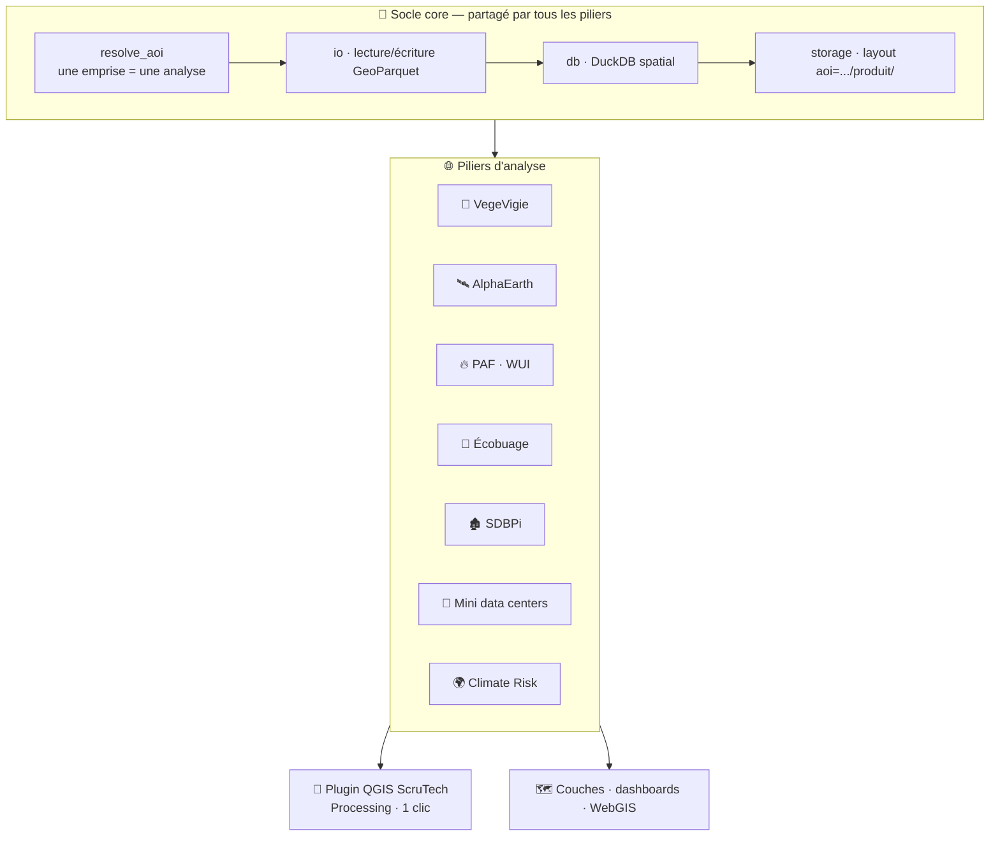
```mermaid
flowchart TB
    subgraph Socle["🧱 Socle core — partagé par tous les piliers"]
        AOI["resolve_aoi<br/>une emprise = une analyse"]
        IO["io · lecture/écriture GeoParquet"]
        DB["db · DuckDB spatial"]
        ST["storage · layout aoi=.../produit/"]
        AOI --> IO --> DB --> ST
    end
    Socle --> P
    subgraph P["🌐 Piliers d'analyse"]
        V["🌿 VegeVigie"]
        AE["🛰️ AlphaEarth"]
        PA["🔥 PAF · WUI"]
        EC["🌾 Écobuage"]
        SD["🏚️ SDBPi"]
        MD["🏢 Mini data centers"]
        CR["🌍 Climate Risk"]
    end
    P --> QGIS["🧩 Plugin QGIS ScruTech<br/>Processing · 1 clic"]
    P --> WEB["🗺️ Couches · dashboards · WebGIS"]
```

**💡 En clair** : une seule « boîte à outils » géo. On lui donne une zone sur la carte, elle va
chercher la donnée (satellite ou open data), calcule, et renvoie des couches prêtes à ouvrir
dans QGIS. Chaque pilier répond à une question métier différente, mais tous s'appuient sur les
mêmes fondations.

---

### 🌿 VegeVigie — sentinelle de la végétation

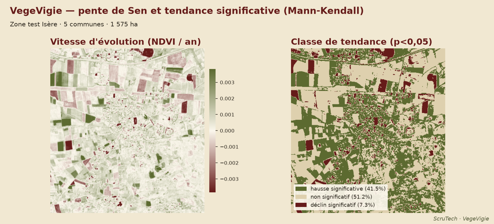

Surveille la santé de la végétation à partir d'une décennie d'images **Sentinel-2** : NDVI →
composites mensuels → **tendances significatives** (Mann-Kendall + Sen) → **stress hydrique**
(anomalies, VCI) → **classement par commune**.

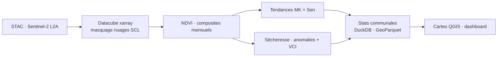
```mermaid
flowchart LR
    A["STAC · Sentinel-2 L2A"] --> B["Datacube xarray<br/>masquage nuages SCL"]
    B --> C["NDVI · composites mensuels"]
    C --> D["Tendances MK + Sen"]
    C --> E["Sécheresse · anomalies + VCI"]
    D --> F["Stats communales<br/>DuckDB · GeoParquet"]
    E --> F
    F --> G["Cartes QGIS · dashboard"]
```

**⚙️ Technique** — recherche STAC (Planetary Computer) → datacube `xarray`/`dask`, masque
nuages via bande SCL → NDVI → composites mensuels médians (comble les trous courts) →
Mann-Kendall + pente de Sen **par pixel** (vectorisé, validé contre `pymannkendall`) → anomalies
NDVI (z-score) + VCI → agrégation zonale et ranking DuckDB. CLI `typer` idempotente et cachée
(`aoi → search → cube → ndvi → trend → drought → zonal`), **60+ tests** hors-ligne.
**💡 En clair** — est-ce que la forêt verdit ou dépérit, où, et à quel point souffre-t-elle de
la sécheresse ? On empile 10 ans de photos satellite d'un même lieu et on mesure la pente : ça
monte (verdissement) ou ça descend (brunissement), commune par commune.

➡️ [Code, démos et méthodologie](scrutech/vegevigie/) · [Plugin QGIS ScruTech](scrutech/vegevigie/qgis_plugin/)

---

### 🛰️ AlphaEarth — empreintes satellite (Google DeepMind)

Utilise les **embeddings satellite** `SATELLITE_EMBEDDING/V1` (64 dimensions par pixel, annuel,
10 m) servis sur **Google Earth Engine** comme moteur de classification d'occupation du sol et
de **détection de changement** — complément « signature riche » de VegeVigie.

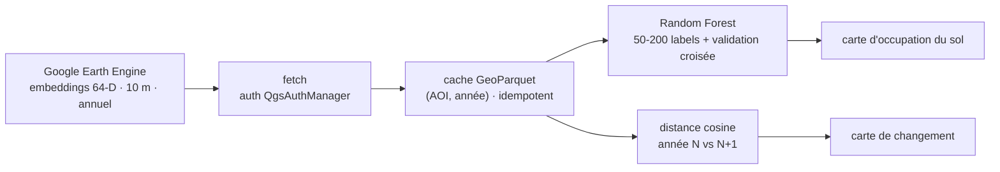
```mermaid
flowchart LR
    A["Google Earth Engine<br/>embeddings 64-D · 10 m · annuel"] --> B["fetch<br/>auth QgsAuthManager"]
    B --> C["cache GeoParquet<br/>(AOI, année) · idempotent"]
    C --> D1["Random Forest<br/>50-200 labels + validation croisée"]
    C --> D2["distance cosine<br/>année N vs N+1"]
    D1 --> E["carte d'occupation du sol"]
    D2 --> F["carte de changement"]
```

**⚙️ Technique** — `client` : requête GEE, auth par **QgsAuthManager** (jamais de clé en dur),
estimation du coût quota. `store` : cache GeoParquet par (AOI, année) avec provenance.
`classifier` : Random Forest sur les 64 features, **validation croisée obligatoire**. `change` :
distance cosine entre deux années (un vrai changement de surface, pas un artefact atmosphérique).
Deps lourdes (`earthengine-api`, `scikit-learn`) → **pilier optionnel**, interpréteur externe.
**💡 En clair** — Google a déjà « résumé » chaque pixel de la planète en 64 chiffres qui
capturent sa nature (forêt, eau, bâti…). On s'en sert pour classer le territoire avec très peu
d'exemples, et pour repérer ce qui a changé d'une année sur l'autre.

➡️ [Moteur AlphaEarth](scrutech/alphaearth/)

---

### 🔥 PAF — interface habitat-forêt (WUI)

Pilier « feu ». Calcule la **frontière forêt↔bâti** — la géométrie la plus critique de
l'incendie : débroussaillement légal (OLD 50 m), chaleur radiante et sautes de braises se jouent
tous dans une bande étroite autour de cette ligne.

```mermaid
flowchart LR
    A["Forêt (VégéVigie)"] --> U["union + reprojection L93"]
    B["Bâti"] --> R["buffer contact_m<br/>OLD 50 m"]
    U --> L["frontière = lisière ∩ portée<br/>interface_line"]
    R --> L
    U --> Z["bande OLD = forêt ∩ portée<br/>interface_zone"]
    R --> Z
    L --> O["métriques + GeoParquet / GeoJSON"]
    Z --> O
```

**⚙️ Technique** — cœur pur GeoPandas/Shapely : union des forêts et du bâti en CRS métrique
(L93), buffer `contact_m` autour du bâti, `boundary ∩ buffer` = ligne d'interface,
`forêt ∩ buffer` = bande OLD à traiter ; métriques (km de frontière, ha de bande, bâti exposé) ;
exports GeoParquet (L93) + GeoJSON (WGS84) pour le WebGIS. Intégré au moteur `vegevigie`.
**💡 En clair** — où la forêt touche-t-elle les maisons ? C'est là que ça brûle et qu'on est
légalement obligé de débroussailler. L'outil trace cette ligne de contact et la bande de 50 m à
défendre.

➡️ [Conception, schéma & doc PAF](scrutech/paff/)

---

### 🌾 Écobuage — aptitude au brûlage dirigé

Analyse **multicritère** pour hiérarchiser les zones de brûlage dirigé en milieu pastoral :
combine biomasse, embroussaillement, pente, accès et historique feux en un score d'aptitude.

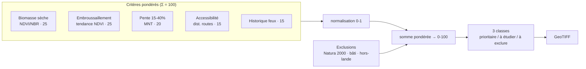
```mermaid
flowchart LR
    subgraph C["Critères pondérés (Σ = 100)"]
      C1["Biomasse sèche<br/>NDVI/NBR · 25"]
      C2["Embroussaillement<br/>tendance NDVI · 25"]
      C3["Pente 15-40%<br/>MNT · 20"]
      C4["Accessibilité<br/>dist. routes · 15"]
      C5["Historique feux · 15"]
    end
    C --> N["normalisation 0-1"]
    N --> W["somme pondérée → 0-100"]
    X["Exclusions<br/>Natura 2000 · bâti · hors-lande"] --> W
    W --> K["3 classes<br/>prioritaire / à étudier / à exclure"]
    K --> G["GeoTIFF"]
```

**⚙️ Technique** — pile de rasters-critères alignés (même grille/CRS), chacun ramené en 0-1
puis pondéré (poids sommant à 100) ; masque d'exclusion dur (Natura 2000, proximité bâti, hors
landes/parcours) → score 0. `aptitude()` fait la somme pondérée, `classify()` applique les seuils
(≥66 / 33-66 / <33). Réutilise les indices VegeVigie (NDVI, NBR, tendance). Export GeoTIFF.
**💡 En clair** — sur quelles parcelles pastorales le brûlage contrôlé est-il pertinent et sûr ?
On note chaque zone de 0 à 100 selon la végétation, la pente, l'accès et les enjeux, puis on trie
en trois catégories.

➡️ [Méthodologie & moteur de scoring](scrutech/ecobuage/)

---

### 🏚️ SDBPi — bâtiments professionnels inoccupés

Croise **BD TOPO (bâti) × SIRENE (activité)** : un bâtiment commercial/industriel sans
établissement actif géolocalisé à proximité est un **candidat à l'inoccupation** (méthode type
Cerema).

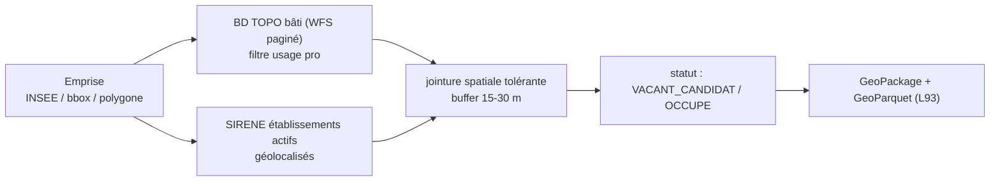
```mermaid
flowchart LR
    A["Emprise<br/>INSEE / bbox / polygone"] --> B["BD TOPO bâti (WFS paginé)<br/>filtre usage pro"]
    A --> C["SIRENE établissements actifs<br/>géolocalisés"]
    B --> J["jointure spatiale tolérante<br/>buffer 15-30 m"]
    C --> J
    J --> S["statut : VACANT_CANDIDAT / OCCUPE"]
    S --> O["GeoPackage + GeoParquet (L93)"]
```

**⚙️ Technique** — acquisition paginée WFS BD TOPO (COUNT plafonné → `STARTINDEX`) + SIRENE
(partition par section NAF pour contourner le plafond 10 000, source de masse Grand Lyon en
alternative) ; filtre usage pro ; jointure spatiale tolérante au buffer (la géoloc SIRENE est à
l'adresse BAN, décalée du footprint) ; `statut_occupation`. Testé sur Bourg-en-Bresse et une
emprise Grand Lyon (**19 572 bâtiments pro**, analyse de sensibilité au buffer).
**💡 En clair** — quels locaux commerciaux ou industriels semblent vides ? On regarde s'il existe
une entreprise active enregistrée à cette adresse ; si non, le bâtiment est un candidat à
vérifier sur le terrain (pas une certitude).

➡️ [Pipeline & résultats](scrutech/sdbpi/)

---

### 🏢 Mini data centers résidentiels — sélection de sites

Méthodologie de **scoring de parcelles cadastrales** pour implanter des mini data centers
résidentiels : cinq filtres spatiaux successifs, pensée coût-d'abord et cloud-native.

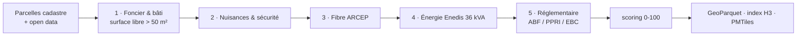
```mermaid
flowchart LR
    A["Parcelles cadastre<br/>+ open data"] --> F1["1 · Foncier & bâti<br/>surface libre > 50 m²"]
    F1 --> F2["2 · Nuisances & sécurité"]
    F2 --> F3["3 · Fibre ARCEP"]
    F3 --> F4["4 · Énergie Enedis 36 kVA"]
    F4 --> F5["5 · Réglementaire<br/>ABF / PPRI / EBC"]
    F5 --> S["scoring 0-100"]
    S --> O["GeoParquet · index H3 · PMTiles"]
```

**⚙️ Technique** — cible cloud-native : dbt-duckdb spatial → GeoParquet partitionné (par
département) → index **H3** (r9) + R-tree DuckDB → PMTiles. Cinq filtres (foncier, nuisances,
fibre ARCEP, énergie Enedis, réglementaire) → score 0-100. Approche coût-d'abord (140 M parcelles
via grille H3), validation spatiale stricte (`ST_IsValid`, CV spatiale et non K-Fold classique).
Analyse réelle multi-axes sur **Alba-la-Romaine** (export GeoPackage + styles QML).
**💡 En clair** — où peut-on poser un petit data center chez des particuliers ? On élimine
successivement les parcelles impossibles (trop petites, sans fibre, sans électricité suffisante,
interdites), puis on note celles qui restent.

➡️ [Méthodologie, prompts SIG et outil](scrutech/mini_dc/)

---

### 🌍 Climate Risk Analyzer (EUDR) — *fondation v0.1*

Plugin QGIS d'évaluation du **risque de déforestation EUDR** et du **stress climatique 2050**
pour des localisations de fournisseurs (supply chain / ESG).

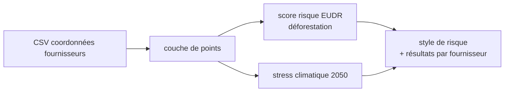
```mermaid
flowchart LR
    A["CSV coordonnées fournisseurs"] --> B["couche de points"]
    B --> C["score risque EUDR<br/>déforestation"]
    B --> D["stress climatique 2050"]
    C --> E["style de risque<br/>+ résultats par fournisseur"]
    D --> E
```

**⚙️ Technique** — plugin QGIS : import CSV → couche de points temporaire → scores EUDR + climat
(**mock** pour l'instant) → style de risque → tableau par fournisseur. Statut : fondation
(v0.1.0, `experimental`) — le branchement sur les vraies sources (Hansen/GFC, projections
climatiques) reste à faire.
**💡 En clair** — mes fournisseurs sont-ils installés sur des zones récemment déboisées ou
menacées par le climat en 2050 ? Prototype qui pose la chaîne ; les scores réels viendront.

➡️ [Plugin Climate Risk](scrutech/climate_risk_analyzer/)

## 🔬 Analyses en images

Figures produites par le vrai code du pipeline VegeVigie (démos sur données synthétiques,
reproductibles via `vegevigie run --small`) :

<table>
  <tr>
    <td align="center" width="50%">
       
      <b>Tendances par pixel</b> — verdissement/brunissement, Mann-Kendall + pente de Sen
    </td>
    <td align="center" width="50%">
      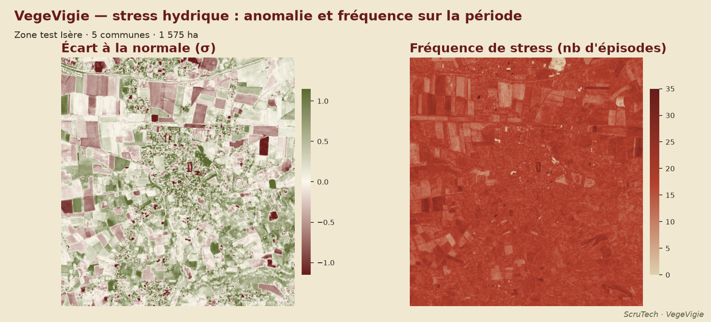 
      <b>Stress hydrique</b> — anomalies NDVI (z-score) et indice VCI
    </td>
  </tr>
  <tr>
    <td align="center" width="50%">
      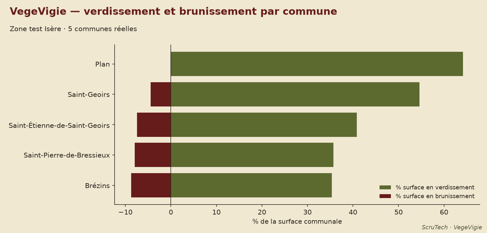 
      <b>Classement communal</b> — agrégation zonale et requêtes DuckDB
    </td>
    <td align="center" width="50%">
      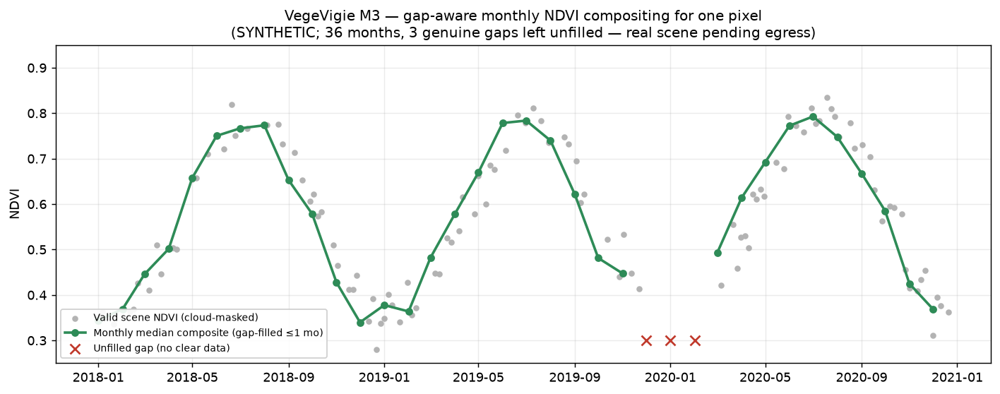 
      <b>Séries temporelles</b> — composites NDVI mensuels, robustes aux nuages
    </td>
  </tr>
</table>

## 📊 Statistiques du dépôt

Chiffres et graphiques **générés automatiquement toutes les 48 h** depuis l'historique Git
réel (script [`scripts/generate_stats.py`](scripts/generate_stats.py), sans dépendance externe).

<!-- AUTO-STATS:START -->
| 📦 Commits | 📅 Jours actifs | 🗂️ Projets |
|:---:|:---:|:---:|
| **75** | **30** | **1** |

| 🐍 Lignes de Python | ✅ Tests automatisés | 🥇 Langage principal |
|:---:|:---:|:---:|
| **15 375** | **142** | **Python (72,1 %)** |

*Dernière mise à jour automatique : 1 septembre 2026 à 13:59 (heure de Paris) — commit `ea89bb3`.*
<!-- AUTO-STATS:END -->

<picture>
  <source media="(prefers-color-scheme: dark)" srcset="assets/activity-dark.svg">
  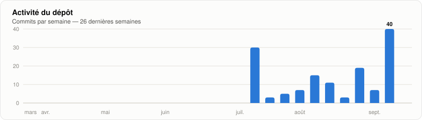
</picture>

<table>
  <tr>
    <td width="50%">
      <picture>
        <source media="(prefers-color-scheme: dark)" srcset="assets/languages-dark.svg">
        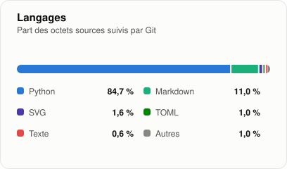
      </picture>
    </td>
    <td width="50%">
      <picture>
        <source media="(prefers-color-scheme: dark)" srcset="assets/weekdays-dark.svg">
        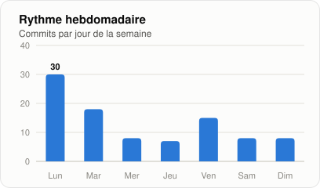
      </picture>
    </td>
  </tr>
</table>

## 🛠️ La stack en un schéma

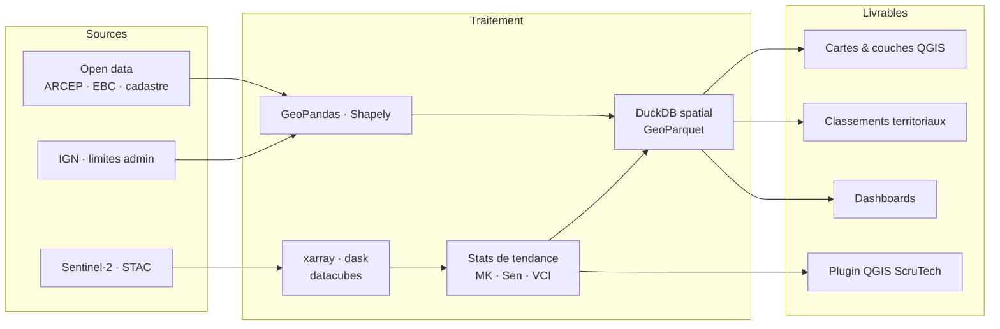
```mermaid
flowchart LR
    subgraph Sources
        S1[Sentinel-2 · STAC]
        S2[IGN · limites admin]
        S3[Open data<br/>ARCEP · EBC · cadastre]
    end
    subgraph Traitement
        T1[xarray · dask<br/>datacubes]
        T2[GeoPandas · Shapely]
        T3[Stats de tendance<br/>MK · Sen · VCI]
        T4[DuckDB spatial<br/>GeoParquet]
    end
    subgraph Livrables
        L1[Cartes & couches QGIS]
        L2[Classements territoriaux]
        L3[Dashboards]
        L4[Plugin QGIS ScruTech]
    end
    S1 --> T1 --> T3 --> T4
    S2 --> T2 --> T4
    S3 --> T2
    T4 --> L1 & L2 & L3
    T3 --> L4
```

## ⚙️ Automatisation du portfolio

Cette page s'entretient toute seule : un workflow GitHub Actions
([`portfolio.yml`](.github/workflows/portfolio.yml)) tourne **tous les deux jours**, régénère
statistiques et graphiques SVG (thèmes clair/sombre) depuis l'historique Git, puis committe le
résultat — un commit d'activité est créé même sans changement.

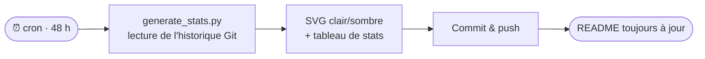
```mermaid
flowchart LR
    A([⏰ cron · 48 h]) --> B[generate_stats.py<br/>lecture de l'historique Git]
    B --> C[SVG clair/sombre<br/>+ tableau de stats]
    C --> D[Commit & push]
    D --> E([README toujours à jour])
```

## 📫 Contact

- GitHub : [@BastienLebrou](https://github.com/BastienLebrou)
- E-mail : [bastienlebrou1@gmail.com](mailto:bastienlebrou1@gmail.com)

Les statistiques et visuels de cette page sont calculés depuis l'historique Git réel du
dépôt — rien n'est saisi à la main.
