

<picture>
  <source media="(prefers-color-scheme: dark)" srcset="assets/banner-dark.svg">
  
</picture>

**Ingénierie de données géospatiales · Télédétection · Aide à la décision territoriale**

## Positionnement

Je transforme des questions de territoire en **pipelines reproductibles, testés et
cartographiables** : de l'image satellite ou de l'open data jusqu'à des couches SIG prêtes à la
décision. La logique de fond est constante : le backend calcule, QGIS lit, et chaque résultat
est régénérable à la commande.

Ce dépôt réunit ces travaux dans une plateforme unique, **ScruTech**, dont les composants
partagent un socle technique commun. Il sert autant de démonstration d'ingénierie que de boîte à
outils opérationnelle pour l'analyse environnementale et l'aménagement.

## Domaines d'intervention

| Domaine | Capacités | Technologies clés |
|---|---|---|
| **Télédétection & datacubes** | séries temporelles Sentinel-2, indices spectraux, composites | STAC, xarray / dask, rasterio, odc-stac |
| **Data engineering géospatial** | pipelines reproductibles, stockage analytique, tuilage | DuckDB spatial, GeoParquet, COG, index H3, PMTiles |
| **Analyse spatiale & multicritère** | scoring MCDA, jointures spatiales, maillage, connectivité | GeoPandas, Shapely, PostGIS |
| **Statistiques environnementales** | détection de tendance et de rupture, anomalies | Mann-Kendall, pente de Sen, Pettitt, VCI |
| **Restitution & outillage SIG** | plugin QGIS, cartographie, tableaux de bord, WebGIS | QGIS Processing, Streamlit, styles QML |
| **Industrialisation** | tests, typage, intégration continue, packaging | pytest, ruff, mypy, GitHub Actions, uv |

## La plateforme ScruTech

Un principe directeur : **une emprise en entrée (AOI), tout le reste en dérive.** On désigne une
zone sur la carte, la plateforme va chercher la donnée (satellite ou open data), calcule, et
renvoie des couches prêtes à ouvrir dans QGIS. Chaque composant répond à une question métier
distincte, mais tous reposent sur le même socle `core` : résolution d'emprise, I/O GeoParquet,
base DuckDB spatial, layout de stockage `aoi=…/produit/`. Le même moteur tourne en CLI, en batch
ou en un clic via le plugin QGIS Processing.

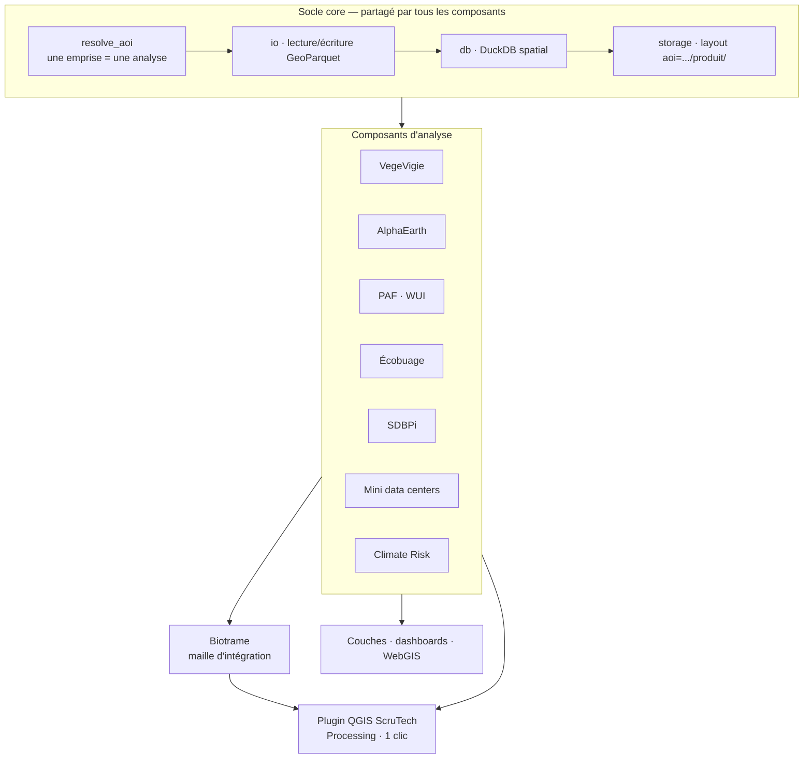
```mermaid
flowchart TB
    subgraph Socle["Socle core — partagé par tous les composants"]
        AOI["resolve_aoi<br/>une emprise = une analyse"]
        IO["io · lecture/écriture GeoParquet"]
        DB["db · DuckDB spatial"]
        ST["storage · layout aoi=.../produit/"]
        AOI --> IO --> DB --> ST
    end
    Socle --> P
    subgraph P["Composants d'analyse"]
        V["VegeVigie"]
        AE["AlphaEarth"]
        PA["PAF · WUI"]
        EC["Écobuage"]
        SD["SDBPi"]
        MD["Mini data centers"]
        CR["Climate Risk"]
    end
    P --> BIO["Biotrame<br/>maille d'intégration"]
    BIO --> QGIS["Plugin QGIS ScruTech<br/>Processing · 1 clic"]
    P --> QGIS
    P --> WEB["Couches · dashboards · WebGIS"]
```

### Biotrame, la brique d'intégration

Là où les autres composants produisent chacun un indicateur, **Biotrame les croise** sur une
maille hexagonale H3 pour hiérarchiser un territoire. C'est la couche qui répond à la séquence
**Éviter, Réduire, Compenser (ERC)** : où sont les mailles prioritaires pour la compensation
écologique ?

Ci-dessous, une sortie réelle du moteur sur une emprise en Ardèche : 412 hexagones H3 (r8)
classés par croisement *enjeu × connectivité × dégradation* (réservoirs Natura 2000 / ZNIEFF,
zones humides déduites du MNT, tendance de verdissement). Les corridors rouges sont les mailles
prioritaires.

  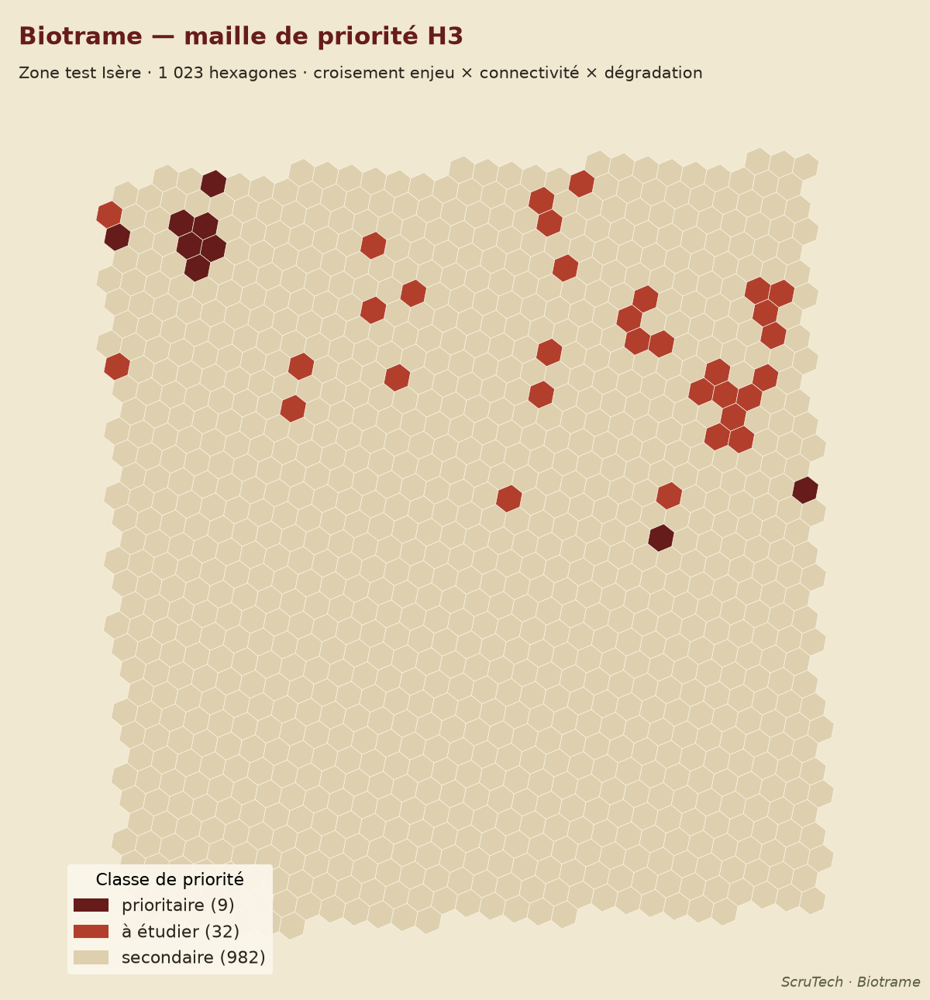

➡️ [Moteur Biotrame & sources TVB](scrutech/biotrame/)

---

## Composants

Sept composants, chacun adressant une question métier. Le statut indique la maturité : de la
fondation posée au pipeline testé sur données réelles.

### VegeVigie — sentinelle de la végétation

**Enjeu.** La forêt verdit-elle ou dépérit-elle, où, et à quel point souffre-t-elle de la
sécheresse ? On empile dix ans de Sentinel-2 sur un même lieu et on mesure la pente du signal,
commune par commune.

**Approche.** Recherche STAC (Planetary Computer), datacube `xarray` / `dask`, masquage des
nuages par bande SCL, NDVI puis composites mensuels médians. Mann-Kendall et pente de Sen
appliqués **par pixel** (vectorisés, validés contre `pymannkendall`), puis anomalies NDVI
(z-score) et VCI pour le stress hydrique, enfin agrégation zonale et classement communal DuckDB.

**Livrables.** CLI `typer` idempotente et cachée (`aoi → search → cube → ndvi → trend → drought
→ zonal`), rasters de tendance et de sécheresse, statistiques communales, plus de 60 tests
hors-ligne.

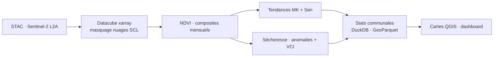
```mermaid
flowchart LR
    A["STAC · Sentinel-2 L2A"] --> B["Datacube xarray<br/>masquage nuages SCL"]
    B --> C["NDVI · composites mensuels"]
    C --> D["Tendances MK + Sen"]
    C --> E["Sécheresse · anomalies + VCI"]
    D --> F["Stats communales<br/>DuckDB · GeoParquet"]
    E --> F
    F --> G["Cartes QGIS · dashboard"]
```

➡️ [Code, démos et méthodologie](scrutech/vegevigie/) · [Plugin QGIS ScruTech](scrutech/vegevigie/qgis_plugin/)

---

### AlphaEarth — empreintes satellite (Google DeepMind)

[-495057)](scrutech/alphaearth/)

**Enjeu.** Google a « résumé » chaque pixel de la planète en 64 chiffres qui capturent sa nature
(forêt, eau, bâti). On s'en sert pour classer un territoire avec très peu d'exemples, et pour
repérer ce qui a changé d'une année sur l'autre.

**Approche.** Embeddings `SATELLITE_EMBEDDING/V1` (64 dimensions, annuel, 10 m) servis sur Google
Earth Engine. Requête authentifiée par **QgsAuthManager** (jamais de clé en dur) avec estimation
du coût quota, cache GeoParquet par (AOI, année) avec provenance, classification Random Forest à
validation croisée obligatoire, détection de changement par distance cosine entre deux années
(un vrai changement de surface, pas un artefact atmosphérique).

**Livrables.** Carte d'occupation du sol, carte de changement inter-annuel. Dépendances lourdes
(`earthengine-api`, `scikit-learn`) isolées : composant optionnel à interpréteur externe.

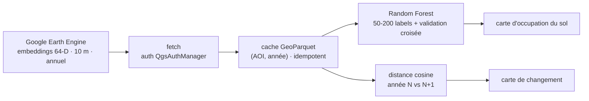
```mermaid
flowchart LR
    A["Google Earth Engine<br/>embeddings 64-D · 10 m · annuel"] --> B["fetch<br/>auth QgsAuthManager"]
    B --> C["cache GeoParquet<br/>(AOI, année) · idempotent"]
    C --> D1["Random Forest<br/>50-200 labels + validation croisée"]
    C --> D2["distance cosine<br/>année N vs N+1"]
    D1 --> E["carte d'occupation du sol"]
    D2 --> F["carte de changement"]
```

➡️ [Moteur AlphaEarth](scrutech/alphaearth/)

---

### PAF — interface habitat-forêt (WUI)

**Enjeu.** Où la forêt touche-t-elle les habitations ? C'est là que l'incendie menace et que le
débroussaillement est une obligation légale. Débroussaillement (OLD 50 m), chaleur radiante et
sautes de braises se jouent tous dans une bande étroite autour de cette ligne de contact.

**Approche.** Cœur pur GeoPandas / Shapely en CRS métrique (Lambert-93) : union des forêts et du
bâti, buffer `contact_m` autour du bâti, intersection `boundary ∩ buffer` pour la ligne
d'interface, `forêt ∩ buffer` pour la bande OLD à traiter.

**Livrables.** Métriques (km de frontière, hectares de bande, bâti exposé), exports GeoParquet
(L93) et GeoJSON (WGS84) pour le WebGIS. Intégré au moteur `vegevigie`.

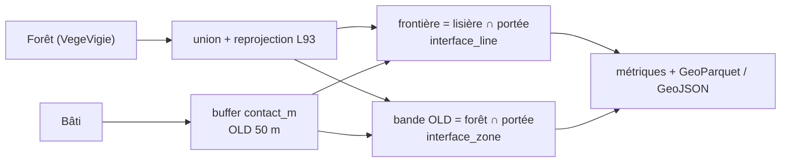
```mermaid
flowchart LR
    A["Forêt (VegeVigie)"] --> U["union + reprojection L93"]
    B["Bâti"] --> R["buffer contact_m<br/>OLD 50 m"]
    U --> L["frontière = lisière ∩ portée<br/>interface_line"]
    R --> L
    U --> Z["bande OLD = forêt ∩ portée<br/>interface_zone"]
    R --> Z
    L --> O["métriques + GeoParquet / GeoJSON"]
    Z --> O
```

➡️ [Conception, schéma et documentation PAF](scrutech/paff/)

---

### Écobuage — aptitude au brûlage dirigé

**Enjeu.** Sur quelles parcelles pastorales le brûlage contrôlé est-il pertinent et sûr ? On
note chaque zone de 0 à 100 selon la végétation, la pente, l'accès et les enjeux, puis on trie
en trois catégories.

**Approche.** Analyse multicritère : pile de rasters-critères alignés (même grille et CRS),
chacun ramené en 0-1 puis pondéré (poids sommant à 100), avec masque d'exclusion dur (Natura
2000, proximité du bâti, hors landes et parcours). `aptitude()` calcule la somme pondérée,
`classify()` applique les seuils (≥ 66 / 33-66 / < 33). Réutilise les indices VegeVigie (NDVI,
NBR, tendance).

**Livrables.** Raster GeoTIFF classé en trois catégories : prioritaire, à étudier, à exclure.

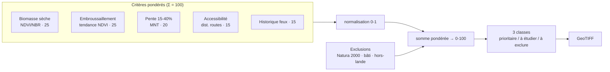
```mermaid
flowchart LR
    subgraph C["Critères pondérés (Σ = 100)"]
      C1["Biomasse sèche<br/>NDVI/NBR · 25"]
      C2["Embroussaillement<br/>tendance NDVI · 25"]
      C3["Pente 15-40%<br/>MNT · 20"]
      C4["Accessibilité<br/>dist. routes · 15"]
      C5["Historique feux · 15"]
    end
    C --> N["normalisation 0-1"]
    N --> W["somme pondérée → 0-100"]
    X["Exclusions<br/>Natura 2000 · bâti · hors-lande"] --> W
    W --> K["3 classes<br/>prioritaire / à étudier / à exclure"]
    K --> G["GeoTIFF"]
```

➡️ [Méthodologie et moteur de scoring](scrutech/ecobuage/)

---

### SDBPi — bâtiments professionnels inoccupés

**Enjeu.** Quels locaux commerciaux ou industriels semblent vides ? On vérifie s'il existe une
entreprise active enregistrée à cette adresse ; si non, le bâtiment devient un candidat à
contrôler sur le terrain (indice, pas certitude).

**Approche.** Croisement **BD TOPO (bâti) × SIRENE (activité)**, méthode de type Cerema.
Acquisition paginée WFS BD TOPO (COUNT plafonné, `STARTINDEX`) et SIRENE (partition par section
NAF pour contourner le plafond de 10 000), filtre usage professionnel, jointure spatiale
tolérante au buffer (la géolocalisation SIRENE est à l'adresse BAN, décalée du footprint).

**Livrables.** Statut d'occupation par bâtiment, exports GeoPackage et GeoParquet (L93). Testé
sur Bourg-en-Bresse et une emprise Grand Lyon (19 572 bâtiments professionnels, avec analyse de
sensibilité au buffer).

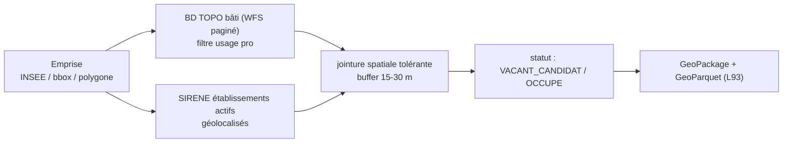
```mermaid
flowchart LR
    A["Emprise<br/>INSEE / bbox / polygone"] --> B["BD TOPO bâti (WFS paginé)<br/>filtre usage pro"]
    A --> C["SIRENE établissements actifs<br/>géolocalisés"]
    B --> J["jointure spatiale tolérante<br/>buffer 15-30 m"]
    C --> J
    J --> S["statut : VACANT_CANDIDAT / OCCUPE"]
    S --> O["GeoPackage + GeoParquet (L93)"]
```

➡️ [Pipeline et résultats](scrutech/sdbpi/)

---

### Mini data centers résidentiels — sélection de sites

**Enjeu.** Où peut-on implanter un petit data center chez des particuliers ? On élimine
successivement les parcelles impossibles (trop petites, sans fibre, sans électricité suffisante,
interdites), puis on note celles qui restent.

**Approche.** Cible cloud-native : dbt-duckdb spatial, GeoParquet partitionné par département,
index **H3** (r9) et R-tree DuckDB, tuilage PMTiles. Cinq filtres successifs (foncier,
nuisances, fibre ARCEP, énergie Enedis, réglementaire) puis score 0-100. Approche coût-d'abord
(140 M de parcelles via grille H3), validation spatiale stricte (`ST_IsValid`, validation
croisée spatiale plutôt que K-Fold classique).

**Livrables.** Analyse réelle multi-axes sur Alba-la-Romaine (export GeoPackage et styles QML).

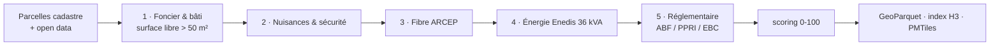
```mermaid
flowchart LR
    A["Parcelles cadastre<br/>+ open data"] --> F1["1 · Foncier & bâti<br/>surface libre > 50 m²"]
    F1 --> F2["2 · Nuisances & sécurité"]
    F2 --> F3["3 · Fibre ARCEP"]
    F3 --> F4["4 · Énergie Enedis 36 kVA"]
    F4 --> F5["5 · Réglementaire<br/>ABF / PPRI / EBC"]
    F5 --> S["scoring 0-100"]
    S --> O["GeoParquet · index H3 · PMTiles"]
```

➡️ [Méthodologie, prompts SIG et outil](scrutech/mini_dc/)

---

### Climate Risk Analyzer (EUDR)

**Enjeu.** Mes fournisseurs sont-ils installés sur des zones récemment déboisées, ou menacées
par le climat en 2050 ? Un prototype qui pose la chaîne pour la conformité EUDR et l'ESG ; les
scores réels viendront.

**Approche.** Plugin QGIS : import CSV de coordonnées fournisseurs, couche de points temporaire,
scores EUDR et climat (**mock** pour l'instant), style de risque, tableau par fournisseur. Le
branchement sur les vraies sources (Hansen / GFC, projections climatiques) reste à faire.

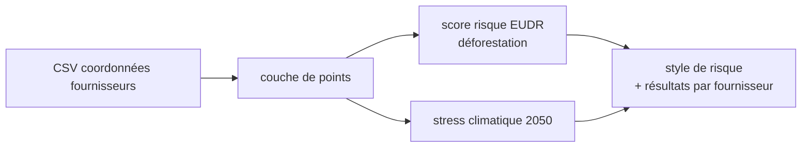
```mermaid
flowchart LR
    A["CSV coordonnées fournisseurs"] --> B["couche de points"]
    B --> C["score risque EUDR<br/>déforestation"]
    B --> D["stress climatique 2050"]
    C --> E["style de risque<br/>+ résultats par fournisseur"]
    D --> E
```

➡️ [Plugin Climate Risk](scrutech/climate_risk_analyzer/)

## Résultats en images

Figures produites par le vrai code du pipeline VegeVigie (démonstrations sur données
synthétiques, reproductibles via `vegevigie run --small`).

<table>
  <tr>
    <td align="center" width="50%">
       
      <b>Tendances par pixel</b> — verdissement et brunissement, Mann-Kendall + pente de Sen
    </td>
    <td align="center" width="50%">
       
      <b>Stress hydrique</b> — anomalies NDVI (z-score) et indice VCI
    </td>
  </tr>
  <tr>
    <td align="center" width="50%">
       
      <b>Classement communal</b> — agrégation zonale et requêtes DuckDB
    </td>
    <td align="center" width="50%">
       
      <b>Séries temporelles</b> — composites NDVI mensuels, robustes aux nuages
    </td>
  </tr>
</table>

## Activité du dépôt

Chiffres et graphiques **générés automatiquement toutes les 48 heures** depuis l'historique Git
réel (script [`scripts/generate_stats.py`](scripts/generate_stats.py), sans dépendance externe).

<!-- AUTO-STATS:START -->
| 📦 Commits | 📅 Jours actifs | 🗂️ Projets |
|:---:|:---:|:---:|
| **87** | **39** | **1** |

| 🐍 Lignes de Python | ✅ Tests automatisés | 🥇 Langage principal |
|:---:|:---:|:---:|
| **16 200** | **152** | **Python (71,2 %)** |

*Dernière mise à jour automatique : 13 septembre 2026 à 14:16 (heure de Paris) — commit `b1c49e7`.*
<!-- AUTO-STATS:END -->

<picture>
  <source media="(prefers-color-scheme: dark)" srcset="assets/activity-dark.svg">
  
</picture>

<table>
  <tr>
    <td width="50%">
      <picture>
        <source media="(prefers-color-scheme: dark)" srcset="assets/languages-dark.svg">
        
      </picture>
    </td>
    <td width="50%">
      <picture>
        <source media="(prefers-color-scheme: dark)" srcset="assets/weekdays-dark.svg">
        
      </picture>
    </td>
  </tr>
</table>

## La stack en un schéma

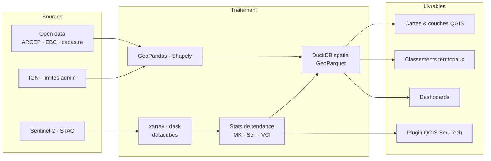
```mermaid
flowchart LR
    subgraph Sources
        S1[Sentinel-2 · STAC]
        S2[IGN · limites admin]
        S3[Open data<br/>ARCEP · EBC · cadastre]
    end
    subgraph Traitement
        T1[xarray · dask<br/>datacubes]
        T2[GeoPandas · Shapely]
        T3[Stats de tendance<br/>MK · Sen · VCI]
        T4[DuckDB spatial<br/>GeoParquet]
    end
    subgraph Livrables
        L1[Cartes & couches QGIS]
        L2[Classements territoriaux]
        L3[Dashboards]
        L4[Plugin QGIS ScruTech]
    end
    S1 --> T1 --> T3 --> T4
    S2 --> T2 --> T4
    S3 --> T2
    T4 --> L1 & L2 & L3
    T3 --> L4
```

## Qualité et industrialisation

- **Tests d'abord.** Chaque composant s'exécute hors-ligne sur données synthétiques ou mockées ;
  plus de 150 tests automatisés.
- **Intégration continue.** Lint (ruff), typage (mypy), tests (pytest) à chaque push via GitHub
  Actions ; veille de dépendances (Dependabot).
- **Reproductibilité.** Environnements verrouillés (uv / `uv.lock`), CLI idempotentes et cachées,
  stockage analytique versionnable (GeoParquet, COG).
- **Sécurité.** Aucun secret en dépôt, secrets par variables d'environnement, requêtes HTTP
  systématiquement bornées, validation des entrées aux frontières de confiance
  ([politique de sécurité](SECURITY.md)).

## Entretien automatique de la page

Cette page s'entretient seule : un workflow GitHub Actions
([`portfolio.yml`](.github/workflows/portfolio.yml)) tourne **tous les deux jours**, régénère les
statistiques et les graphiques SVG (thèmes clair et sombre) depuis l'historique Git, puis
committe le résultat.

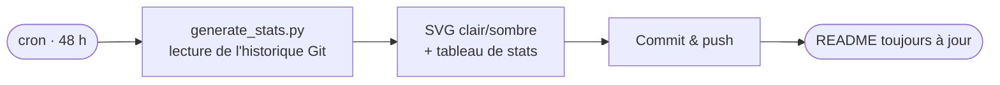
```mermaid
flowchart LR
    A([cron · 48 h]) --> B[generate_stats.py<br/>lecture de l'historique Git]
    B --> C[SVG clair/sombre<br/>+ tableau de stats]
    C --> D[Commit & push]
    D --> E([README toujours à jour])
```

## Contact

- GitHub : [@BastienLebrou](https://github.com/BastienLebrou)
- E-mail : [bastienlebrou1@gmail.com](mailto:bastienlebrou1@gmail.com)
- Recherche un poste de **géomaticien / ingénieur données géospatiales** (Métropole de Lyon ou à
  distance).

Les statistiques et visuels de cette page sont calculés depuis l'historique Git réel du
dépôt. Rien n'est saisi à la main.
