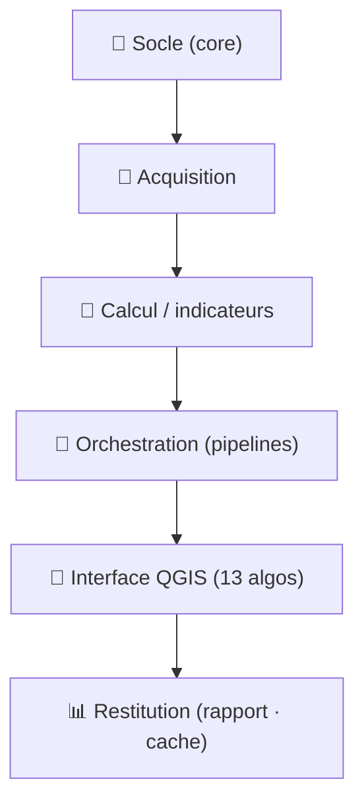

# 🗺️ Cartographie des scripts ScruTech

Vue d'ensemble de **tous les scripts** du dépôt, regroupés par **rôle fonctionnel** (et non
par pilier), pour comprendre d'un coup d'œil « qui fait quoi ». Le fil rouge : une **emprise**
en entrée → la donnée est **acquise** → des **indicateurs** sont calculés → **orchestrés** en
pipelines → exposés dans **QGIS** → **restitués** (rapport, cache).

> Convention : `pkg` = package installable (a un `pyproject.toml`) ; `plat` = modules plats
> (imports directs, sans package). Chemins relatifs à `scrutech/`.

---

## 🧱 1. Socle partagé — `core/` (pkg)
Le tronc commun : tout pilier en dépend. « Une emprise = une analyse ».

| Script | Rôle |
|---|---|
| `core/src/core/aoi.py` | **`resolve_aoi`** : normalise n'importe quelle entrée (INSEE, dept, bbox, fichier, GeoDataFrame) en objet `Aoi` (id stable + géométrie WGS84). `communes_in_aoi` déduit les communes d'une emprise. |
| `core/src/core/sources.py` | **Clé de voûte** : va chercher la donnée en WFS à partir de l'emprise — BD TOPO (`fetch_buildings/forest/roads`), INPN réservoirs (`fetch_biodiversity_reservoirs`), corridors TVB régionaux (`fetch_tvb_corridors`). |
| `core/src/core/storage.py` | Layout des produits (`{SCRUTECH_DATA}/{pilier}/aoi=…/produit/`), + **cache** (`cache_outputs`/`list_cached`) pour recharger sans recalcul. |
| `core/src/core/db.py` | Connexion + schéma DuckDB (base centrale requêtable). |
| `core/src/core/io.py` | Lecture/écriture vecteur (GeoParquet, formats SIG). |
| `core/src/core/constants.py` | Constantes CRS (WGS84, Lambert-93) + alias `BBox`. |

## 📡 2. Acquisition de données (télédétection & open data)

| Script | Rôle |
|---|---|
| `vegevigie/src/vegevigie/catalog.py` | Recherche **STAC** (Planetary Computer) des scènes Sentinel-2 sur l'emprise + fenêtre temporelle ; mise en cache des items. |
| `vegevigie/src/vegevigie/datacube.py` | Construit le **datacube** xarray/dask à partir des scènes (bandes rouge/NIR/SCL), à la résolution demandée. |
| `storage/download_aura.py` | Téléchargeur régional AURA (open data, 12 départements) — script d'alimentation. |
| `storage/init_db.py` · `storage/schema.sql` | Initialise la base DuckDB centrale (schéma SQL). |
| `mini_dc/outil/telecharge_arcep.py` · `telecharge_ebc.py` | Téléchargements open data (fibre ARCEP, espaces boisés classés) pour le pilier mini data centers. |

## 🧮 3. Calcul / indicateurs (le cœur scientifique)

**VegeVigie — végétation (Sentinel-2)**
| Script | Rôle |
|---|---|
| `vegevigie/src/vegevigie/indices.py` | **NDVI masqué** : indice de végétation + masquage nuages via la bande SCL. |
| `vegevigie/src/vegevigie/composite.py` | Composites **mensuels médians** du NDVI (robustes aux nuages) + comblement des trous courts. |
| `vegevigie/src/vegevigie/seasonal.py` | **Déseasonnalisation** (retrait du cycle saisonnier) avant la tendance — l'équivalent numpy de STL. |
| `vegevigie/src/vegevigie/trend.py` | **Mann-Kendall + pente de Sen** par pixel → verdissement / brunissement (validé contre `pymannkendall`). |
| `vegevigie/src/vegevigie/breaks.py` | **Test de Pettitt** par pixel → *année de rupture* (coupe, incendie, sécheresse) — équivalent BFAST-lite. |
| `vegevigie/src/vegevigie/drought.py` | **Sécheresse** : anomalie NDVI (z-score) + indice VCI + timeline. |
| `vegevigie/src/vegevigie/zonal.py` | Agrégation **zonale** (stats par commune) des rasters de tendance/sécheresse. |

**Biotrame — priorisation écologique (H3)** — `biotrame/` (pkg)
| Script | Rôle |
|---|---|
| `biotrame/src/biotrame/mesh.py` | Maillage **hexagonal H3** d'une emprise. |
| `biotrame/src/biotrame/aggregate.py` | Par hexagone : **enjeu** (recouvrement réservoirs) + **connectivité** (proximité corridors/réservoirs). |
| `biotrame/src/biotrame/score.py` | Croise enjeu × connectivité × dégradation en **moyenne géométrique** → score 0-100 + 3 classes. |

**AlphaEarth — empreintes satellite (GEE)** — `alphaearth/` (pkg)
| Script | Rôle |
|---|---|
| `alphaearth/src/alphaearth/client.py` | Requête **Google Earth Engine** (embeddings 64-D) + auth service-account + distance cosine serveur. |
| `alphaearth/src/alphaearth/change.py` | Distance cosine + **détection de changement** N vs N+1 (seuil par percentile). |
| `alphaearth/src/alphaearth/classifier.py` | **Random Forest** sur les 64 features + validation croisée obligatoire. |
| `alphaearth/src/alphaearth/store.py` | Cache GeoParquet des embeddings par (AOI, année) + provenance. |

**Écobuage — aptitude au brûlage** — `ecobuage/` (pkg)
| Script | Rôle |
|---|---|
| `ecobuage/ecobuage.py` | Moteur pur : `rescale`/`band`/`aptitude`/`classify` → score 0-100 + 3 classes, export GeoTIFF. |

**PAF — interface habitat-forêt**
| Script | Rôle |
|---|---|
| `vegevigie/src/vegevigie/interface.py` | Frontière **forêt↔bâti** (`boundary ∩ buffer`) + bande OLD ; `build_interface_from_aoi` (emprise seule). |

## 🎼 4. Orchestration (assemblage en pipelines)

| Script | Rôle |
|---|---|
| `vegevigie/src/vegevigie/pipeline.py` | **Le moteur VegeVigie** : search → cube → NDVI → composites → déseasonnalisation → tendance + rupture → sécheresse → zonal. |
| `vegevigie/src/vegevigie/ecobuage_aoi.py` | Orchestrateur **écobuage emprise-seule** : pente (MNT) + accès (routes) + exclusions (bâti) + végétation → aptitude. |
| `vegevigie/src/vegevigie/biotrame_aoi.py` | Orchestrateur **biotrame emprise-seule** : maillage + réservoirs + corridors + dégradation zonale → score. |
| `vegevigie/src/vegevigie/qgis_runner.py` | **Dispatcher** : point d'entrée sous-processus ; aiguille par `task` (vegevigie / paf / alphaearth / ecobuage / biotrame / cache). |
| `vegevigie/src/vegevigie/cli.py` | CLI `typer` (lancement en ligne de commande, étapes idempotentes). |
| `vegevigie/src/vegevigie/config.py` | Paramètres (Pydantic + YAML) : CRS, résolution, seuils, chemins. |
| `vegevigie/src/vegevigie/store.py` | Écriture des résultats (GeoParquet + DuckDB) côté VegeVigie. |

## 🧩 5. Interface QGIS — `vegevigie/qgis_plugin/scrutech/` (13 algorithmes)
Le Processing Toolbox séquencé en 6 étapes. Chaque algo est fin : il prépare les paramètres et
délègue au moteur (natif QGIS ou interpréteur externe via le runner).

| Groupe | Algorithme (`algorithms/…`) | Rôle |
|---|---|---|
| 1 · Préparer | `load_communes.py` | Charge les communes de l'emprise. |
| 2 · Indicateurs | `analyze_extent.py` | ① VegeVigie (tendance + rupture + sécheresse). |
| 2 · Indicateurs | `alphaearth_change.py` | ② Changement satellite AlphaEarth. |
| 2 · Indicateurs | `paf_interface_aoi.py` | ③ Interface habitat-forêt (emprise). |
| 2 · Indicateurs | `ecobuage_aptitude_aoi.py` | ④ Aptitude à l'écobuage (emprise + MNT). |
| 3 · Prioriser | `biotrame_priority.py` | Priorisation écologique (biotrame). |
| 4 · Restituer | `report_launch.py` | Rapport visuel Streamlit. |
| 4 · Restituer | `load_cached.py` | Recharge une analyse depuis le cache. |
| 5 · Bâti & territoire | `sdbpi_vacance.py` · `mini_dc_sites.py` | Piliers bâti (SDBPi, mini DC). |
| 6 · Outils avancés | `paf_interface.py` · `ecobuage_aptitude.py` | Versions « couches en entrée » (legacy). |
| *(non enregistré)* | `geoai_segment.py` | ⚠️ Segmentation GeoAI **expérimentale**, pas dans le provider. |

**Helpers du plugin** (`algorithms/_*.py`) : `_external` (sous-processus + `run_spec`), `_venv`
(auto-détection interpréteur), `_styles` (QML auto), `_icons`, `_qgis_compat` (shim QGIS 4),
`provider.py` (enregistre les 13 algos), `scrutech_plugin.py` (bouton barre d'outils).

## 📊 6. Restitution (voir & réutiliser)

| Script | Rôle |
|---|---|
| `vegevigie/src/vegevigie/report/data.py` | `discover()` : repère les sorties de chaque pilier dans un dossier. |
| `vegevigie/src/vegevigie/report/app.py` | **App Streamlit** : carte + métriques + graphes de tous les piliers. |
| `vegevigie/src/vegevigie/dashboard/{app,data}.py` | Dashboard VegeVigie historique (choroplèthe communes + ranking DuckDB). |

## 🏚️ 7. Piliers annexes (projets à part)

| Pilier | Scripts | Rôle |
|---|---|---|
| **SDBPi** (`sdbpi/`, plat) | `config`, `net`, `sources`, `processing`, `run_vacance` | Bâtiments pro inoccupés : BD TOPO × SIRENE → candidats vacance. |
| **Mini_dc** (`mini_dc/outil/`, plat) | `config`, `db`, `pipeline`, `run`, `generate_synthetic`, `adapter_donnees_reelles`, `analyse_reelle`, `telecharge_*` | Scoring de parcelles (data centers résidentiels), pipeline DuckDB. |
| **Climate Risk** (`climate_risk_analyzer/`) | plugin `eudr_analyzer_*` | Risque déforestation EUDR + climat 2050 (fondation v0.1, mock). |
| **PAFF** (`paff/reference/`) | `interface.py` (snapshot) | Copie de référence du module interface (le code exécutable vit dans `vegevigie`). |

## ✅ 8. Qualité (tests & CI)

| Élément | Rôle |
|---|---|
| `*/tests/test_*.py` | Tests **hors-ligne** (réseau mocké, données synthétiques) : core, vegevigie, biotrame, alphaearth, sdbpi, mini_dc. |
| `.github/workflows/ci.yml` | CI : ruff + mypy + **3 sessions pytest** (packages / SDBPi / mini_dc — modules `config` plats séparés). |
| Discipline | Ponytail (le code le plus lazy qui marche), un test runnable par logique non triviale. |

---

## 📌 Note de lecture
- **Le code est déjà documenté** : chaque module ouvre sur un docstring qui explique le *quoi*
  et le *pourquoi* (souvent en français pour les piliers). Cette cartographie est la **carte** ;
  les docstrings sont le **détail**.
- Les **orchestrateurs `*_aoi.py`** (dans `vegevigie`) branchent les moteurs purs (dans les
  packages `biotrame`/`ecobuage`/`alphaearth`) sur les sources de données — c'est là que se lit
  le « emprise seule ».
- Voir aussi le vault Obsidian `claude_vault/ScruTech/` pour les fiches vulgarisées par pilier.
