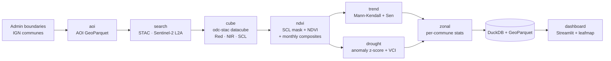
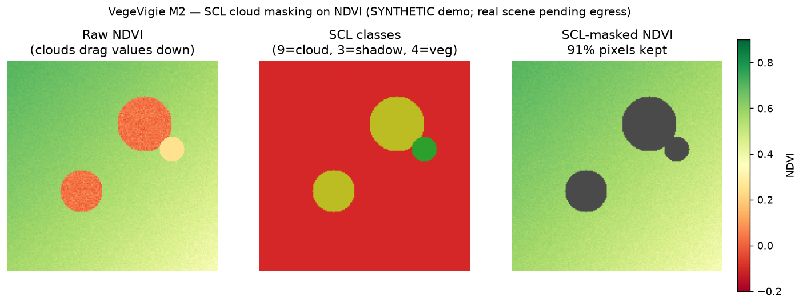

# 🌿 VegeVigie

> **Sentinelle de la végétation** — where and how fast is vegetation greening or browning,
> and where is drought stress emerging? A reproducible geodata-engineering pipeline that
> answers this **commune by commune** for the Ardèche (France) from a decade of Sentinel-2
> imagery: NDVI time series → statistically significant trends → drought anomalies →
> per-commune rankings → dashboard.


*Per-pixel greening/browning from Mann-Kendall + Sen's slope. (Figures on this page are
rendered by the real pipeline code on synthetic inputs — see [Reproducing](#reproducing)
and [Status & limitations](#status--limitations).)*

---

## The problem

Vegetation change is slow, noisy and cloud-obscured — a single satellite image tells you
almost nothing about a *trend*. To see where a landscape is durably greening or browning,
and where drought is biting, you need to (1) stack years of imagery into a clean time
series per pixel, (2) test each pixel for a real monotonic trend, not just noise, and
(3) roll the result up to units people act on — communes. VegeVigie does exactly that,
as a cached, reproducible, testable pipeline.

## Architecture



Each box is one idempotent CLI stage that reads from config, caches to `data/`, and can run
standalone. Data access is abstracted behind a STAC backend so a Copernicus (CDSE) source
can replace Planetary Computer without touching callers.

## Tech stack

| Concern | Tools |
|---|---|
| Data access | `pystac-client`, `planetary-computer` (Microsoft Planetary Computer STAC) |
| Datacube | `odc-stac`, `xarray`, `dask`, `rioxarray`, `rasterio`, `zarr` |
| Trend stats | vectorized Mann-Kendall + Theil–Sen (validated vs `pymannkendall`), `scipy` |
| Vector / store | `geopandas`, `shapely`, `duckdb`, `pyarrow` (GeoParquet) |
| CLI / dashboard | `typer`, `streamlit` + `leafmap` (M7) |
| Quality | `pytest`, `ruff`, `mypy`, `pre-commit`, GitHub Actions CI |
| Env | Python 3.11+, `uv` |

## Quickstart

```bash
cd vegevigie
uv sync
uv run vegevigie --help

# Full small-AOI smoke run (aoi → search → cube → ndvi → trend → drought → zonal)
uv run vegevigie run --small --start 2020 --end 2020
```

Or drive a single stage at a time:

```bash
uv run vegevigie aoi --small                        # AOI + commune boundaries
uv run vegevigie search  --small --start 2020 --end 2020
uv run vegevigie cube    --start 2020 --end 2020    # lazy datacube
uv run vegevigie ndvi    --start 2020 --end 2020    # SCL mask + NDVI + monthly composites
uv run vegevigie trend   --start 2020 --end 2020    # greening/browning raster
uv run vegevigie drought --start 2020 --end 2020    # anomaly / VCI + timeline
uv run vegevigie zonal   --start 2020 --end 2020    # per-commune ranking (DuckDB)
```

> **Network note.** `search`/`cube` need outbound access to
> `planetarycomputer.microsoft.com`. Under a restricted egress policy the pipeline reports
> the blocked host and stops cleanly — allowlist that host (or run outside the sandbox) to
> pull imagery. Boundaries (`aoi`) come from the reachable `france-geojson` mirror of
> official IGN data.

## Sample outputs

| NDVI cloud masking | Monthly composites |
|---|---|
|  |  |

| Drought anomaly + timeline | Commune ranking |
|---|---|
|  |  |

## Methodology

- **Sentinel-2 L2A** surface reflectance (10 m Red/NIR), harmonized with the BOA offset.
- **SCL cloud masking** — keep vegetation/bare/water/unclassified; drop
  cloud/shadow/cirrus/snow/defective pixels before any index.
- **NDVI** = (NIR − Red) / (NIR + Red).
- **Monthly median composites**, gap-aware: irregular clear observations → one robust value
  per month; short gaps interpolated, genuine long gaps left as NaN.
- **Trend** — per-pixel **Mann-Kendall** (direction + tie-corrected p-value) and
  **Theil–Sen slope** (robust magnitude), vectorized over the datacube with dask and
  validated pixel-for-pixel against `pymannkendall`.
- **Drought** — NDVI **anomaly** (z-score vs a per-pixel monthly climatology) and **VCI**
  (0–100 vs the pixel-month min/max); an AOI-mean timeline flags dry years.
- **Zonal** — rasterize communes onto the value grid, reduce per commune, store in DuckDB +
  GeoParquet, rank by trend and drought exposure.

See [`docs/glossary.md`](docs/glossary.md) for every remote-sensing term (STAC, COG, SCL,
datacube, MK, Sen, VCI, zonal stats).

## Status & limitations

**Landed:** M0 scaffold → **M6** (aoi, search, cube, ndvi, monthly composites, trend,
drought, zonal + DuckDB ranking, plus the `run` orchestrator). **In progress:** M7
Streamlit dashboard. The pure-science stages (masking, NDVI, compositing, MK/Sen, anomaly,
zonal) are unit-tested offline; the figures above are produced by that same code on
synthetic inputs, because this build environment's egress policy blocks Planetary Computer —
so the live Sentinel-2 fetch (`search`/`cube`) hasn't run here yet.

- **Resolution vs compute** — department-wide passes run at coarse resolution (config knob)
  to stay laptop-tractable; 10 m is reserved for small AOIs.
- **Cloud gaps** — persistent winter cloud leaves real gaps; we leave them as NaN rather
  than fabricate data.
- **Trend model** — Mann-Kendall assumes monotonicity; abrupt regime shifts (fire, clear-cut)
  are trend-detected but not characterized.

## Next steps

- **M7–M8** — dashboard, hero imagery, and a full live run once STAC egress is available.
- **Post-v1 — ScruTech QGIS plugin.** The end goal is to wrap this pipeline as an automated
  **QGIS Processing plugin** (*ScruTech*): the science lives in CLI/UI-agnostic pure
  functions (`indices`, `composite`, `trend`, `drought`, `zonal`) precisely so a QGIS
  algorithm can reuse `src/vegevigie` as its engine. See `CLAUDE.md` §11.
- Alternate data backend (Copernicus CDSE), SAR/ML land-cover — out of v1 scope.

## Development

```bash
uv run ruff check . && uv run ruff format --check .
uv run mypy
uv run pytest
uv run pre-commit install   # lint on every commit
```

---

*Portfolio project by Bastien Lebrou. Built milestone by milestone — see `CLAUDE.md` for the
full scope, roadmap and conventions.*
