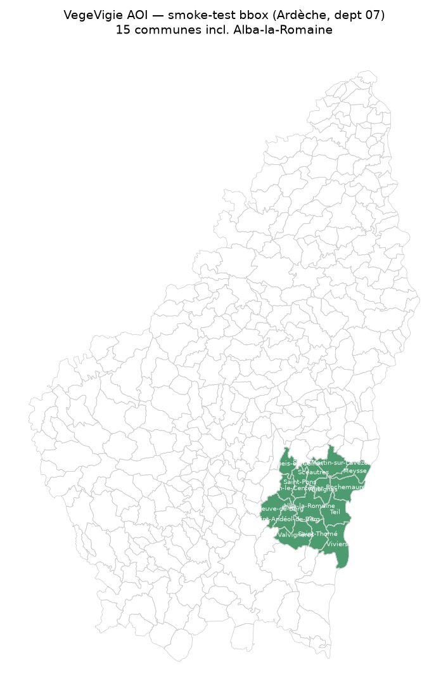

# VegeVigie

*VegeVigie — sentinelle de la végétation. NDVI trends & drought stress from Sentinel-2,
commune by commune.*

A reproducible geodata-engineering pipeline that watches vegetation health over time from
Sentinel-2 imagery: NDVI time series, statistically significant greening/browning trends
(Mann-Kendall + Sen's slope), and drought-stress flags — aggregated to the commune level
for the Ardèche département and served through a small dashboard.

> **Status: M6 (zonal → DuckDB ranking).** The pixel pipeline (`aoi`/`search`/`cube`/`ndvi`/
> `trend`/`drought`) feeds `zonal`, which aggregates the trend/drought rasters to communes,
> writes GeoParquet + DuckDB, and ranks communes by greening/browning and drought
> exposure. Config is validated, lint/mypy/tests/CI are green. Remaining: M7 dashboard, M8
> portfolio polish — see `CLAUDE.md` §6.



*Smoke-test AOI: 15 communes of southern Ardèche (incl. Alba-la-Romaine) inside the
default bbox, over the full département outline.*


*SCL cloud masking (synthetic demo — real scene pending network egress): raw NDVI with
clouds/shadow → SCL classes → masked NDVI with flagged pixels blanked. Regenerate with
`uv run python scripts/demo_ndvi_masking.py`.*


*Gap-aware monthly compositing (synthetic demo): irregular cloud-masked scenes → a clean
monthly median line, with short gaps interpolated and a genuine winter data gap left
unfilled. Regenerate with `uv run python scripts/demo_monthly_ndvi.py`.*


*Per-pixel Mann-Kendall + Sen's slope (synthetic cube, real trend code): Sen's slope map
and the significant greening/browning class map. Regenerate with
`uv run python scripts/demo_trend_map.py`.*


*NDVI-anomaly drought stress (synthetic cube, real drought code): z-score anomaly map for a
dry summer and the AOI-mean drought timeline. Regenerate with
`uv run python scripts/demo_drought.py`.*


*Zonal aggregation to the **real** 15 Ardèche communes (synthetic trend raster, real zonal +
DuckDB code): per-commune mean Sen's slope, ranked by a DuckDB `SELECT ... ORDER BY`.
Regenerate with `uv run python scripts/demo_zonal_ranking.py`.*

## Quickstart

```bash
cd vegevigie
uv sync
uv run vegevigie --help

# M1 — build the AOI and search for scenes (small bbox, one year)
uv run vegevigie aoi --small
uv run vegevigie search --small --start 2020 --end 2020

# M2/M3 — datacube, then SCL-mask + NDVI + monthly composites (needs search cache)
uv run vegevigie cube --start 2020 --end 2020
uv run vegevigie ndvi --start 2020 --end 2020

# M4 — per-pixel Mann-Kendall + Sen's slope trend raster (needs monthly composites)
uv run vegevigie trend --start 2020 --end 2020

# M5 — NDVI-anomaly / VCI drought raster + timeline (needs monthly composites)
uv run vegevigie drought --start 2020 --end 2020

# M6 — aggregate to communes -> GeoParquet + DuckDB, print commune ranking
uv run vegevigie zonal --start 2020 --end 2020
```

> **Network note.** `search` needs outbound access to
> `planetarycomputer.microsoft.com`. Under a restricted egress policy it reports the
> blocked host and exits cleanly — allowlist that host (or run outside the sandbox) to
> fetch scenes. The boundary source (`aoi`) uses the reachable `france-geojson` mirror of
> official IGN data; see `src/vegevigie/aoi.py`.

## Development

```bash
uv run ruff check . && uv run ruff format --check .
uv run pytest
uv run pre-commit install   # once, to lint on every commit
```
