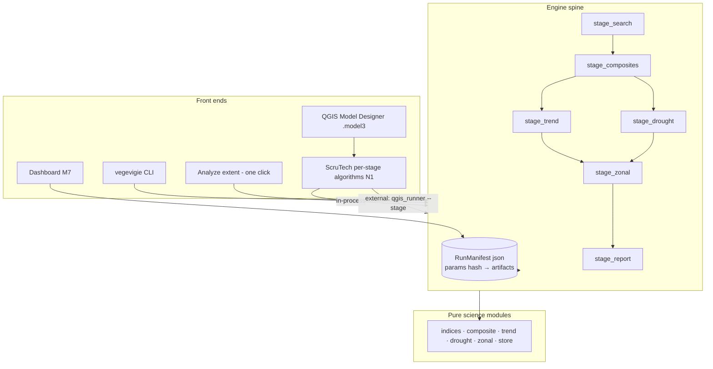

# ScruTech — analysis, proposed features & interconnection plan

*Repo analysis snapshot: July 2026. This document is the working roadmap for the
ScruTech QGIS plugin (CLAUDE.md §11 says to carry this plan across sessions).
Language is English per repo convention (§7); the owner discussion happened in French.*

## Status (updated July 2026, implementation session)

**Landed** — S1 and S2 in full, plus slices of S3/S4: stage functions +
`RunManifest` (`vegevigie/stages.py`), `run_pipeline` recomposed on the stages,
`qgis_runner` stage dispatch + heartbeat, plugin `protocol.py` + `base.py`, the
six per-stage algorithms with declared outputs, *Analyze extent* refactored and
surfacing every product (findings 1–3, 6–11 fixed), bundled QML styles (N3),
QGIS-native commune loader for all départements (N8, findings 4–5), interpreter
persistence/auto-detection (N11→done). Engine spine covered by offline tests
(`test_stages.py`, `test_qgis_runner.py`, `test_scrutech_protocol.py`).

**Still open** — prebuilt `.model3` file (N2; per-stage chaining works, the
shipped model is pending a live-QGIS session to author/validate it), HTML run
report (N5), time-series probe (N6), Check/Bootstrap environment algorithms
(N7), pre-flight cost estimate (N9), polygon AOI masking (N10), CDSE backend
(N11), French i18n (N12), rewiring the CLI commands onto the stage functions
(they still carry their own zarr-based contracts), finding 12's plugin-side
tests beyond the protocol, and a live-QGIS validation pass of the new
algorithms + QMLs (this environment has no QGIS runtime).

---

## 1. Where things stand

The repository holds two portfolio projects:

| Project | State |
|---|---|
| `_data_center_sig` | Site-selection tool (Alba-la-Romaine): synthetic + real-data pipeline, DuckDB scoring, GeoPackage/QML exports for QGIS. Self-contained, French docs. |
| `vegevigie` | Sentinel-2 NDVI trend & drought pipeline. M0–M6 + M8 delivered (CLI per stage, cached zarr/parquet/DuckDB, 12 offline test modules, CI: ruff + mypy + pytest). **M7 dashboard still a stub** (`cli.py` → `_not_implemented("dashboard", "M7")`). |
| `vegevigie/qgis_plugin` | **ScruTech v0.1.0** (experimental): one Processing provider, two algorithms — *Analyze extent* (full pipeline over an extent, in-process **or** external interpreter via `vegevigie.qgis_runner`) and *Load commune boundaries*. Engine + config bundled by `package.py`. |

The architecture bet is already right: all science lives in pure engine modules
(`indices`, `composite`, `trend`, `drought`, `zonal`), orchestrated by the UI-agnostic
`vegevigie.pipeline.run_pipeline`, which both the CLI and the plugin drive. What is
missing is the **interconnection layer**: per-stage entry points with explicit file
contracts, so QGIS models, the CLI, the plugin and the future dashboard all compose
the same building blocks.

## 2. Findings — defects & friction in the current plugin

Ordered by impact; file references point at the current code.

1. **Outputs are not declared, so nothing can be chained.**
   `AnalyzeExtentAlgorithm.initAlgorithm` (`algorithms/analyze_extent.py`) only adds
   parameters; `processAlgorithm` returns ad-hoc dict keys (`TREND`, `DROUGHT`,
   `ZONAL`, `SCENES`). Without `addOutput(QgsProcessingOutput…)` declarations these
   results are invisible to the QGIS Model Designer — the plugin cannot participate
   in user-built models. This is the single biggest interconnection blocker.
2. **`trend_class` is computed and written but never surfaced.** `pipeline.run_pipeline`
   writes `trend_class_<years>.tif` yet `PipelineResult` has no field for it, so the
   plugin neither returns nor loads it. Same for `mk_pvalue` (never written at all).
3. **The drought timeline is dropped on the QGIS side.** `qgis_runner` returns
   `timeline_parquet`, but `AnalyzeExtentAlgorithm._run_external` builds a
   `SimpleNamespace` without it and `_queue_layers` ignores it. The temporal signal —
   one of the most interesting products — never reaches the user.
4. **`Load commune boundaries` fails exactly in the recommended setup.** It runs
   in-process only and gates on `missing_dependencies()`, i.e. the *full* datacube
   stack (odc-stac, xarray, dask…), although it only needs to download one GeoJSON.
   Users following the recommended "external interpreter, keep QGIS clean" path get a
   dependency error. QGIS can fetch and read GeoJSON natively — this algorithm needs
   no third-party dependency at all.
5. **Only département 07 works.** `aoi._DEPT_SLUGS` maps a single code; the algorithm
   advertises any French département but raises for the other ~95.
6. **No compute reuse between runs.** `run_pipeline` caches the STAC item list but
   rebuilds the datacube and composites in memory every run. Re-running the same
   extent with a different significance threshold re-downloads everything.
7. **Cancellation latency in external mode.** The stdout reader loop only checks
   `feedback.isCanceled()` when a line arrives; long silent computations cannot be
   cancelled promptly. A periodic heartbeat `PROGRESS` line from the runner (or a
   non-blocking read) fixes it.
8. **GeoParquet may not load in QGIS.** The zonal layer is queued from `.parquet`,
   which requires a GDAL build with the Parquet driver (common on OSGeo4W, often
   missing on Linux distro builds). Write a GPKG twin for the QGIS-facing copy; keep
   GeoParquet for the data stack.
9. **Deprecated API.** `QgsVectorFileWriter.writeAsVectorFormat` →
   `writeAsVectorFormatV3`.
10. **Dependency lists drift.** The plugin README install line includes `bottleneck`;
    `dependencies.REQUIRED` does not check it. One source of truth should generate both.
11. **`Python executable` UX.** No persisted default: store the last-used value in
    `QgsSettings`, honour a `VEGEVIGIE_PYTHON` env var, and auto-probe
    `<repo>/vegevigie/.venv` so the field is pre-filled.
12. **Zero plugin tests.** The stream protocol (`PROGRESS …` / `RESULT …`) and spec
    building are pure logic; extracted into a QGIS-free `scrutech/protocol.py` they
    can run in CI alongside the engine tests.
13. **`metadata.txt` polish.** Add `changelog=` and `homepage=`; keep
    `experimental=True` until milestone S3 below.

## 3. Proposed features

### 3.1 Interconnection features (the core ask)

- **N1 — Per-stage Processing algorithms.** One algorithm per pipeline stage, each with
  declared, typed inputs/outputs so they chain in the Model Designer and gain QGIS's
  batch mode for free:
  *Search scenes* (extent, years, cloud → items JSON + scene count),
  *Build NDVI composites* (items JSON → monthly zarr + preview),
  *Compute trend* (monthly zarr → sen_slope/trend_class/p-value GeoTIFFs),
  *Compute drought* (monthly zarr → anomaly/VCI GeoTIFFs + timeline parquet),
  *Zonal statistics* (rasters + zones → GPKG/GeoParquet + DuckDB),
  *Rank zones* (DuckDB, metric, direction, N → table).
- **N2 — Prebuilt "run all" model.** Ship `models/scrutech_full.model3` wiring N1
  end-to-end; keep *Analyze extent* as the one-click alias for non-modeler users.
- **N3 — Styled outputs.** Bundle QML files (diverging ramp for Sen's slope,
  categorized greening/none/browning for `trend_class`, anomaly and VCI ramps,
  graduated commune stats) and auto-apply them when layers load. The
  `_data_center_sig` project already proves the QML pattern.
- **N4 — Full product surfacing.** Load `trend_class`, optional `mk_pvalue`, drought
  timeline (as a table + plot), and optionally the monthly NDVI stack (per-month
  GeoTIFFs with temporal metadata for the QGIS Temporal Controller).

### 3.2 User-facing features

- **N5 — HTML run report.** Engine-side `report.py` renders parameters, AOI, scene
  count, trend/drought summaries and top-N zone tables from a run manifest; exposed
  as `vegevigie report` *and* loaded by the plugin after a run. Strong portfolio value.
- **N6 — NDVI time-series probe.** Given a point (or commune) + the monthly zarr,
  plot the NDVI/anomaly curve to a PNG output. Cheap once N1 exists.
- **N7 — Environment tools.** *Check environment* (diagnose interpreter, deps,
  Planetary Computer reachability) and *Bootstrap environment* (create a venv,
  `pip install` the stack, persist its path). Turns the hardest onboarding step into
  an algorithm.
- **N8 — All-départements commune loader.** Reimplement with QGIS-native networking
  (`QgsBlockingNetworkRequest` + GeoJSON layer): zero external deps, works everywhere,
  full département table instead of `_DEPT_SLUGS`.
- **N9 — Pre-flight cost estimate.** Before the heavy load, report scenes × pixels ×
  months and require an explicit "proceed on large runs" checkbox over a threshold
  (CLAUDE.md §10: guard the owner's machine).

### 3.3 Engine-level options (post-S3)

- **N10 — Polygon AOI masking** (clip the cube to a geometry, not just its bbox).
- **N11 — CDSE backend** exposed as a provider choice (the `StacBackend` seam exists).
- **N12 — French i18n** (`.ts`/`.qm`; `tr()` calls are already in place).
- **N13 — Extra indices** (EVI, NDMI) — needs extra bands in the cube; explicitly v3.

## 4. Interconnection plan

Target: every function reachable from four front doors — CLI, ScruTech algorithms,
QGIS models, dashboard — through **one spine**: stage functions + a run manifest +
one subprocess protocol.

### Level 1 — engine spine (`vegevigie/stages.py` or a refactored `pipeline.py`)

- Split `run_pipeline` into **idempotent stage functions** with uniform signatures:
  `stage_x(ctx: RunContext) -> StageArtifacts`. No typer/qgis imports (as today).
- Introduce a **`RunManifest`** persisted as `scrutech_run.json` in the output folder:
  parameter hash, per-stage status, artifact paths, timestamps. A stage first checks
  the manifest and skips itself when its inputs' hash matches (`force` overrides) —
  this delivers finding 6 (compute reuse) for every front end at once.
- `run_pipeline()` becomes a fold over the stages (public API unchanged), and the CLI
  commands become thin wrappers over the same stage functions — removing the chaining
  logic currently duplicated in `cli.run`.

### Level 2 — process boundary (`qgis_runner`)

- Extend the spec with `"stage": "all" | "search" | "composites" | "trend" |
  "drought" | "zonal" | "report"` (+ the manifest path). The existing
  `PROGRESS <pct> <msg>` / `RESULT <json>` line protocol stays, plus a periodic
  heartbeat line so cancellation is responsive (finding 7).
- This one change makes **every** plugin algorithm work in both execution modes
  (in-process and external interpreter) with no per-algorithm subprocess code.

### Level 3 — QGIS layer (`scrutech/`)

- `algorithms/base.py`: `ScruTechAlgorithmBase` owning the shared parameters
  (`PYTHON_EXE` with `QgsSettings` persistence + venv auto-probe, `OUTPUT_FOLDER`),
  the in-process/external dispatch (`run_stage(...)`), error explanation, and layer
  loading with QML styling. Each concrete algorithm shrinks to parameter
  declarations + spec building (~50 lines).
- Every algorithm **declares outputs** (`QgsProcessingOutputRasterLayer`,
  `…VectorLayer`, `…File`, `…Number`) — fixing finding 1 and enabling the Model
  Designer; ship `models/scrutech_full.model3` (N2).
- `protocol.py` (pure: spec build + stream parse) shared by base class and tests.

### Level 4 — presentation & storage contracts

- `styles/*.qml` bundled and applied on load (N3); all products surfaced (N4).
- Zonal outputs written as **GPKG (for QGIS) + GeoParquet + DuckDB (for the data
  stack)** — finding 8.
- The M7 Streamlit dashboard reads the same DuckDB/GeoParquet/manifest — no new
  contract. "One run folder = one manifest = one truth" across CLI, plugin, models
  and dashboard.

## 5. Delivery milestones

Vertical slices, in order; each independently shippable (repo convention §6).

- **S1 — Engine spine.** Stage functions + `RunManifest` + `qgis_runner --stage` +
  heartbeat; CLI rewired onto stages. DoD: `vegevigie run` behaviour unchanged;
  existing plugin still works; manifest/idempotence unit tests green.
- **S2 — Plugin decomposition.** `base.py`, `protocol.py`, the six N1 algorithms with
  declared outputs, *Analyze extent* refactored onto the base, `scrutech_full.model3`.
  DoD: stages chain in the Model Designer; batch mode usable; protocol tests in CI.
- **S3 — Presentation.** QML styles auto-applied; `trend_class`/p-value/timeline/
  monthly loaded; *Rank zones*; HTML report (N5). DoD: a one-click run yields a fully
  styled project + report; `experimental=False` candidate.
- **S4 — Access & UX.** QGIS-native commune loader for all départements (N8),
  persisted/auto-detected interpreter + *Check/Bootstrap environment* (N7), GPKG
  twin for zonal, pre-flight estimate (N9), deprecation + metadata fixes.
- **S5 — Reach.** Polygon AOI masking (N10), CDSE backend (N11), French i18n (N12),
  time-series probe (N6).

## 6. Compatibility notes

- **GeoParquet in QGIS** needs GDAL's Parquet driver — hence the GPKG twin.
- **bottleneck**: reconcile `dependencies.REQUIRED` with the README install line;
  generate the README line from the dict (single source of truth).
- **Windows**: keep `CREATE_NO_WINDOW` and the `_ENV_STRIP` sanitation when adding
  runner calls; they are what make the external mode safe next to QGIS's own GDAL.
- Plugin code must keep total independence from the heavy stack at import time
  (QGIS loads the plugin at startup) — imports stay inside `processAlgorithm`.
